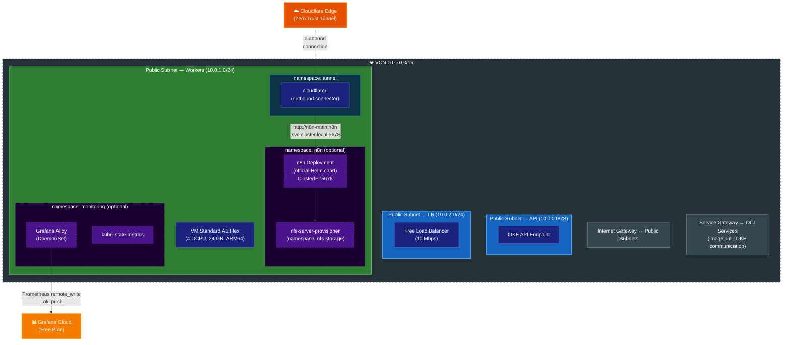

# Terraform OCI OKE Always Free

Terraform module to deploy an OKE (Oracle Kubernetes Engine) cluster using only OCI Always Free tier resources.

## Architecture



> Dashed borders indicate optional components controlled by feature flags (e.g., `enable_n8n`, `enable_grafana_monitoring`).

## Modules

| Module | Purpose |
|---|---|
| `modules/network` | VCN with 3 public subnets (API `10.0.0.0/28`, Workers `10.0.1.0/24`, LB `10.0.2.0/24`), Internet Gateway, Service Gateway, optional NAT Gateway |
| `modules/oke` | `BASIC_CLUSTER` (Flannel CNI) with ARM node pool (`VM.Standard.A1.Flex`). ARM image auto-discovered at plan time by filtering OKE-optimized `aarch64` images matching the cluster's Kubernetes `major.minor` version |
| `modules/budget` | Monthly OCI budget with absolute alert thresholds at $0.01, $1, $2, $3, $4, and $5 |
| `modules/monitoring` | Grafana Alloy (DaemonSet) + kube-state-metrics deployed via Helm. Ships metrics (Prometheus remote_write) and logs (Loki push) to Grafana Cloud Free Plan |

Helm releases for `metrics-server`, `nfs-server-provisioner`, `n8n`, and the `cloudflared` Deployment are declared directly in root `main.tf` (not inside a module).

## What's Always Free

| Resource | Always Free Allocation |
|---|---|
| OKE Basic Cluster | Control plane fully managed and free |
| VM.Standard.A1.Flex | Up to 4 OCPUs + 24 GB RAM total |
| Block Storage | Up to 200 GB total (boot volumes + NFS backing storage) |
| VCN, Subnets, Gateways | Free (IGW, SGW) |
| Load Balancer | 1x flexible (10 Mbps) |

## Cost Warnings

The following resources are **NOT** Always Free and will incur charges:

- **NAT Gateway**: Disabled by default (`enable_nat_gateway = false`)
- **Enhanced Cluster**: Hardcoded to `BASIC_CLUSTER` to prevent accidental charges
- **Non-ARM shapes**: Hardcoded to `VM.Standard.A1.Flex`
- **Exceeding ARM limits**: Validation rules prevent exceeding 4 OCPUs / 24 GB RAM / 200 GB block storage (boot + NFS)

## Prerequisites

- [Terraform](https://www.terraform.io/downloads) >= 1.5.0
- [OCI CLI](https://docs.oracle.com/en-us/iaas/Content/API/SDKDocs/cliinstall.htm) configured
- OCI PAYG (Pay-As-You-Go) account with Always Free resources available
- `kubectl` for cluster interaction

## Quick Start

```bash
# 1. Clone and configure
git clone <repo-url>
cd terraform-oci-oke-alwaysfree
cp terraform.tfvars.example terraform.tfvars
# Edit terraform.tfvars with your OCI credentials

# 2. Deploy
terraform init
terraform plan
terraform apply

# 3. Configure kubectl
$(terraform output -raw kubeconfig_command)

# 4. Verify
kubectl get nodes
```

## Variables

| Name | Description | Type | Default | Required |
|---|---|---|---|---|
| `tenancy_ocid` | The OCID of the tenancy | `string` | `null` | no* |
| `region` | The OCI region | `string` | `null` | no* |
| `user_ocid` | The OCID of the user | `string` | `null` | no* |
| `fingerprint` | API key fingerprint | `string` | `null` | no* |
| `private_key_path` | Path to API private key | `string` | `null` | no* |
| `config_file_profile` | OCI CLI config profile | `string` | `null` | no* |
| `compartment_ocid` | Compartment OCID | `string` | - | yes |
| `cluster_name` | OKE cluster name | `string` | `"alwaysfree-oke"` | no |
| `kubernetes_version` | K8s version | `string` | `null` (latest) | no |
| `node_count` | Worker node count | `number` | `1` | no |
| `node_ocpus` | OCPUs per node | `number` | `4` | no |
| `node_memory_in_gbs` | Memory (GB) per node | `number` | `24` | no |
| `boot_volume_size_in_gbs` | Boot volume (GB) per node | `number` | `64` | no |
| `ssh_public_key` | SSH public key for nodes | `string` | `null` | no |
| `enable_metrics_server` | Deploy metrics-server for `kubectl top` | `bool` | `true` | no |
| `enable_nfs_storage` | Deploy NFS server with dynamic PV provisioning | `bool` | `false` | no |
| `nfs_volume_size_in_gbs` | NFS backing block volume size (GB) | `number` | `136` | no |
| `vcn_cidr` | VCN CIDR block | `string` | `"10.0.0.0/16"` | no |
| `enable_nat_gateway` | Enable NAT Gateway (costs $) | `bool` | `false` | no |
| `enable_budget_alert` | Enable OCI Budget alert | `bool` | `true` | no |
| `notification_email` | Email for budget alerts | `string` | `null` | no** |
| `enable_cloudflare_tunnel` | Deploy shared Cloudflare Zero Trust Tunnel | `bool` | `false` | no |
| `cloudflare_tunnel_namespace` | K8s namespace for Cloudflare Tunnel | `string` | `"tunnel"` | no |
| `cloudflared_secret_name` | K8s Secret name containing `TUNNEL_TOKEN` | `string` | `"cloudflare-tunnel"` | no |
| `enable_n8n` | Deploy n8n workflow automation | `bool` | `false` | no |
| `n8n_namespace` | K8s namespace for n8n | `string` | `"n8n"` | no |
| `n8n_pvc_size` | PVC size for n8n persistent data | `string` | `"5Gi"` | no |
| `n8n_secret_name` | K8s Secret name containing n8n configuration | `string` | `"n8n-secrets"` | no |
| `n8n_chart_version` | n8n Helm chart version (null = latest) | `string` | `null` | no |
| `enable_grafana_monitoring` | Deploy Grafana Alloy + kube-state-metrics to Grafana Cloud | `bool` | `false` | no |
| `grafana_cloud_prometheus_url` | Grafana Cloud Prometheus remote write endpoint | `string` | `null` | no*** |
| `grafana_cloud_prometheus_username` | Grafana Cloud Prometheus instance ID | `string` | `null` | no*** |
| `grafana_cloud_loki_url` | Grafana Cloud Loki push endpoint | `string` | `null` | no*** |
| `grafana_cloud_loki_username` | Grafana Cloud Loki instance ID | `string` | `null` | no*** |
| `grafana_cloud_api_key` | Grafana Cloud API token (sensitive) | `string` | `null` | no*** |
| `monitoring_namespace` | K8s namespace for monitoring | `string` | `"monitoring"` | no |
| `alloy_chart_version` | Grafana Alloy Helm chart version (null = latest) | `string` | `null` | no |
| `kube_state_metrics_chart_version` | kube-state-metrics Helm chart version (null = latest) | `string` | `null` | no |
| `freeform_tags` | Tags for all resources | `map(string)` | `{"alwaysfree"="true"}` | no |

*Either provide `tenancy_ocid` + `user_ocid` + `fingerprint` + `private_key_path` + `region`, or use `config_file_profile`.

**Required when `enable_budget_alert = true`.

***Required when `enable_grafana_monitoring = true`.

## Outputs

| Name | Description |
|---|---|
| `vcn_id` | The OCID of the VCN |
| `cluster_id` | The OCID of the OKE cluster |
| `cluster_endpoint` | Kubernetes API endpoint |
| `kubeconfig_command` | OCI CLI command to generate kubeconfig |
| `nfs_storage_class` | NFS StorageClass name (`"nfs"`) for dynamic PV provisioning (null if disabled) |
| `budget_id` | The OCID of the budget (null if disabled) |
| `n8n_namespace` | Kubernetes namespace where n8n is deployed (null if disabled) |
| `monitoring_namespace` | Kubernetes namespace where monitoring is deployed (null if disabled) |
| `n8n_setup_instructions` | Step-by-step instructions for n8n setup (null if disabled) |

## Cloudflare Zero Trust Tunnel Setup

Cloudflare Tunnel is managed via Terraform as a shared service in the `tunnel` namespace.
See [k8s/README.md](k8s/README.md) for the detailed deployment guide.

```bash
# Quick start:
# 1. Create namespaces and secrets
kubectl apply -f k8s/tunnel-namespace.yaml
kubectl apply -f k8s/namespace.yaml
# Edit k8s/cloudflare-tunnel-secret.yaml and k8s/n8n-secrets.yaml with real values, then:
kubectl apply -f k8s/cloudflare-tunnel-secret.yaml
kubectl apply -f k8s/n8n-secrets.yaml

# 2. Enable in terraform.tfvars
#    enable_cloudflare_tunnel = true
#    enable_n8n               = true

# 3. Deploy
terraform apply
```

This approach eliminates the need for inbound ports, providing security through Cloudflare's Zero Trust network.

## Grafana Cloud Monitoring

Ships cluster metrics and container logs to [Grafana Cloud Free Plan](https://grafana.com/products/cloud/) using **Grafana Alloy** (unified collector) and **kube-state-metrics**.

### What Gets Monitored

| Type | Data | Source |
|------|------|--------|
| Metrics | Container CPU, memory, network, filesystem | kubelet cAdvisor |
| Metrics | Node capacity, allocatable resources | kubelet |
| Metrics | Pod status, restarts, deployment replicas | kube-state-metrics |
| Logs | All container stdout/stderr | Kubernetes API |
| Logs | Kubernetes events (warnings, errors) | Kubernetes API |

### Free Plan Limits

- **10,000** active metric series (estimated usage: ~1,500–2,000)
- **50 GB/month** log ingestion (estimated usage: < 1 GB)
- **14-day** metric retention, **30-day** log retention

### Setup

```bash
# 1. Get credentials from Grafana Cloud Portal:
#    - Prometheus remote_write URL and username
#    - Loki push URL and username
#    - API token (MetricsPublisher role)

# 2. Add to terraform.tfvars:
#    enable_grafana_monitoring         = true
#    grafana_cloud_prometheus_url      = "https://prometheus-prod-xx-xxx.grafana.net/api/prom/push"
#    grafana_cloud_prometheus_username = "123456"
#    grafana_cloud_loki_url            = "https://logs-prod-xxx.grafana.net/loki/api/v1/push"
#    grafana_cloud_loki_username       = "654321"
#    grafana_cloud_api_key             = "glc_xxxxxxxxxxxxx"

# 3. Deploy
terraform apply
```

### Resource Overhead

~70m CPU request, ~210 Mi memory request — less than 1% of the ARM A1.Flex node capacity.
