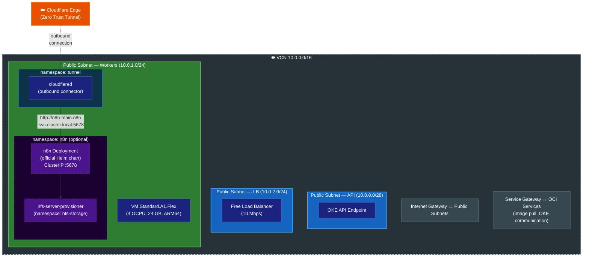

# Terraform OCI OKE Always Free

Terraform module to deploy an OKE (Oracle Kubernetes Engine) cluster using only OCI Always Free tier resources.

## Architecture



> Dashed borders indicate optional components controlled by feature flags (e.g., `enable_n8n`, `enable_cloudflare_tunnel`).

## Modules

| Module | Purpose |
|---|---|
| `modules/network` | VCN with 3 public subnets (API `10.0.0.0/28`, Workers `10.0.1.0/24`, LB `10.0.2.0/24`), Internet Gateway, Service Gateway, optional NAT Gateway |
| `modules/oke` | `BASIC_CLUSTER` (Flannel CNI) with ARM node pool (`VM.Standard.A1.Flex`). ARM image auto-discovered at plan time by filtering OKE-optimized `aarch64` images matching the cluster's Kubernetes `major.minor` version |
| `modules/budget` | Monthly OCI budget with absolute alert thresholds at $0.01, $1, $2, $3, $4, and $5 |

Helm releases for `metrics-server`, `nfs-server-provisioner`, `n8n`, and the `cloudflared` Deployment are declared directly in root `main.tf` (not inside a module).

## What's Always Free

| Resource | Always Free Allocation |
|---|---|
| OKE Basic Cluster | Control plane fully managed and free |
| VM.Standard.A1.Flex | Up to 4 OCPUs + 24 GB RAM total |
| Block Storage | Up to 200 GB total (boot volumes + NFS backing storage) |
| VCN, Subnets, Gateways | Free (IGW, SGW) |
| Load Balancer | 1x flexible (10 Mbps) |

## Cost Warnings

The following resources are **NOT** Always Free and will incur charges:

- **NAT Gateway**: Disabled by default (`enable_nat_gateway = false`)
- **Enhanced Cluster**: Hardcoded to `BASIC_CLUSTER` to prevent accidental charges
- **Non-ARM shapes**: Hardcoded to `VM.Standard.A1.Flex`
- **Exceeding ARM limits**: Validation rules prevent exceeding 4 OCPUs / 24 GB RAM / 200 GB block storage (boot + NFS)
- **Load Balancer**: OCI Always Free includes **1** flexible Load Balancer (10 Mbps). Creating a second Kubernetes Service of type `LoadBalancer` will incur charges (~$10–30/month). This module uses `ClusterIP` + Cloudflare Tunnel for ingress — no LB required. If you do create a `LoadBalancer` Service, limit to exactly one

> [!CAUTION]
> **Sensitive values in Terraform state** — `terraform.tfstate` contains secrets such as `n8n_encryption_key` and `cloudflare_tunnel_token` in plaintext. **Never commit state files to version control.** For production use, configure a [remote backend](https://developer.hashicorp.com/terraform/language/backend) with encryption at rest (e.g., OCI Object Storage with SSE). Consider using [OCI Vault](https://docs.oracle.com/en-us/iaas/Content/KeyManagement/home.htm) or [SOPS](https://github.com/getsops/sops) for external secret management.

## Security Notes

### NFS Server Elevated Privileges

The NFS server provisioner requires Linux capabilities `SYS_ADMIN`, `SYS_RESOURCE`, and `DAC_READ_SEARCH` plus a host `/dev` mount. This is necessary for XFS project quota enforcement (`xfs_quota` needs ioctl access to the backing block device). The trade-off:

- **Without** these capabilities: NFS works but quotas are not enforced — a single PVC can consume the entire backing volume
- **With** these capabilities: kernel-level ENOSPC enforcement per PVC, but the NFS server container has broad system access

The NFS server runs in its own `nfs-storage` namespace, isolated from application workloads. If the NFS server container were compromised, the attacker would gain host-level device access on that node.

## Backup & Disaster Recovery

The n8n PVC uses `lifecycle { prevent_destroy = true }` to guard against accidental data loss. To perform a full `terraform destroy`:

```bash
# 1. Back up n8n data first
kubectl cp n8n/n8n-main-0:/home/node/.n8n ./n8n-backup

# 2. Remove the PVC from Terraform state (does NOT delete the actual PVC)
terraform state rm 'kubernetes_persistent_volume_claim_v1.n8n_data[0]'

# 3. Destroy all resources
terraform destroy
```

To recreate the cluster and reattach existing data, re-run `terraform apply` — the NFS provisioner will create a new backing volume and the n8n PVC will be re-provisioned.

## Prerequisites

- [Terraform](https://www.terraform.io/downloads) >= 1.5.0
- [OCI CLI](https://docs.oracle.com/en-us/iaas/Content/API/SDKDocs/cliinstall.htm) configured
- OCI PAYG (Pay-As-You-Go) account with Always Free resources available
- `kubectl` for cluster interaction

## Quick Start

```bash
# 1. Clone and configure
git clone <repo-url>
cd terraform-oci-oke-alwaysfree
cp terraform.tfvars.example terraform.tfvars
# Edit terraform.tfvars with your OCI credentials

# 2. Deploy
terraform init
terraform plan
terraform apply

# 3. Configure kubectl
$(terraform output -raw kubeconfig_command)

# 4. Verify
kubectl get nodes
```

## Variables

| Name | Description | Type | Default | Required |
|---|---|---|---|---|
| `tenancy_ocid` | The OCID of the tenancy | `string` | `null` | no¹ |
| `region` | The OCI region | `string` | `null` | no¹ |
| `user_ocid` | The OCID of the user | `string` | `null` | no¹ |
| `fingerprint` | API key fingerprint | `string` | `null` | no¹ |
| `private_key_path` | Path to API private key | `string` | `null` | no¹ |
| `config_file_profile` | OCI CLI config profile | `string` | `null` | no¹ |
| `compartment_ocid` | Compartment OCID | `string` | - | yes |
| `cluster_name` | OKE cluster name | `string` | `"formosa"` | no |
| `kubernetes_version` | K8s version | `string` | `null` (latest) | no |
| `node_count` | Worker node count | `number` | `1` | no |
| `node_ocpus` | OCPUs per node | `number` | `4` | no |
| `node_memory_in_gbs` | Memory (GB) per node | `number` | `24` | no |
| `boot_volume_size_in_gbs` | Boot volume (GB) per node | `number` | `64` | no |
| `ssh_public_key` | SSH public key for nodes | `string` | `null` | no |
| `enable_metrics_server` | Deploy metrics-server for `kubectl top` | `bool` | `true` | no |
| `enable_nfs_storage` | Deploy NFS server with dynamic PV provisioning | `bool` | `false` | no |
| `nfs_volume_size_in_gbs` | NFS backing block volume size (GB) | `number` | `136` | no |
| `vcn_cidr` | VCN CIDR block | `string` | `"10.0.0.0/16"` | no |
| `enable_nat_gateway` | Enable NAT Gateway (costs $) | `bool` | `false` | no |
| `enable_budget_alert` | Enable OCI Budget alert | `bool` | `true` | no |
| `notification_email` | Email for budget alerts | `string` | `null` | no² |
| `enable_cloudflare_tunnel` | Deploy shared Cloudflare Zero Trust Tunnel | `bool` | `false` | no |
| `cloudflare_tunnel_namespace` | K8s namespace for Cloudflare Tunnel | `string` | `"tunnel"` | no |
| `cloudflared_secret_name` | K8s Secret name containing `TUNNEL_TOKEN` | `string` | `"cloudflare-tunnel"` | no |
| `cloudflared_image_tag` | cloudflared container image tag | `string` | `"latest"` | no |
| `cloudflare_tunnel_token` | Cloudflare Zero Trust tunnel token | `string` | `null` | no⁴ |
| `enable_n8n` | Deploy n8n workflow automation | `bool` | `false` | no |
| `n8n_namespace` | K8s namespace for n8n | `string` | `"n8n"` | no |
| `n8n_pvc_size` | PVC size for n8n persistent data | `string` | `"5Gi"` | no |
| `n8n_secret_name` | K8s Secret name containing n8n configuration | `string` | `"n8n-secrets"` | no |
| `n8n_chart_version` | n8n Helm chart version (null = latest) | `string` | `null` | no |
| `n8n_image_tag` | n8n container image tag | `string` | `"latest"` | no |
| `n8n_encryption_key` | Encryption key for n8n credentials. Generate: `openssl rand -hex 32` | `string` | `null` | no³ |
| `n8n_host` | Public hostname for n8n (e.g. `n8n.example.com`) | `string` | `null` | no³ |
| `freeform_tags` | Tags for all resources | `map(string)` | `{"alwaysfree"="true"}` | no |

¹ Either provide `tenancy_ocid` + `user_ocid` + `fingerprint` + `private_key_path` + `region`, or use `config_file_profile` — not both.

² Required when `enable_budget_alert = true`.

³ Required when `enable_n8n = true`.

⁴ Required when `enable_cloudflare_tunnel = true`.

## Outputs

| Name | Description |
|---|---|
| `vcn_id` | The OCID of the VCN |
| `cluster_id` | The OCID of the OKE cluster |
| `cluster_endpoint` | Kubernetes API endpoint |
| `kubeconfig_command` | OCI CLI command to generate kubeconfig |
| `nfs_storage_class` | NFS StorageClass name (`"nfs"`) for dynamic PV provisioning (null if disabled) |
| `budget_id` | The OCID of the budget (null if disabled) |
| `n8n_namespace` | Kubernetes namespace for n8n (always created; persists when `enable_n8n = false`) |
| `n8n_setup_instructions` | Required `terraform.tfvars` variables for enabling n8n and Cloudflare Tunnel |

## Cloudflare Zero Trust Tunnel Setup

Cloudflare Tunnel is managed entirely via Terraform. Namespaces, secrets, and the `cloudflared` Deployment are all declared in root `main.tf` — no manual `kubectl apply` required.

See [k8s/README.md](k8s/README.md) for architecture details and troubleshooting.

```bash
# 1. Add to terraform.tfvars:
#    enable_cloudflare_tunnel = true
#    cloudflare_tunnel_token  = "<token from Cloudflare Dashboard → Networks → Tunnels>"
#
#    enable_n8n               = true
#    n8n_host                 = "<your-n8n-hostname>"
#    n8n_encryption_key       = "$(openssl rand -hex 32)"  # generate once; never rotate

# 2. Deploy
terraform apply
```

This approach eliminates the need for inbound ports, providing security through Cloudflare's Zero Trust network.
