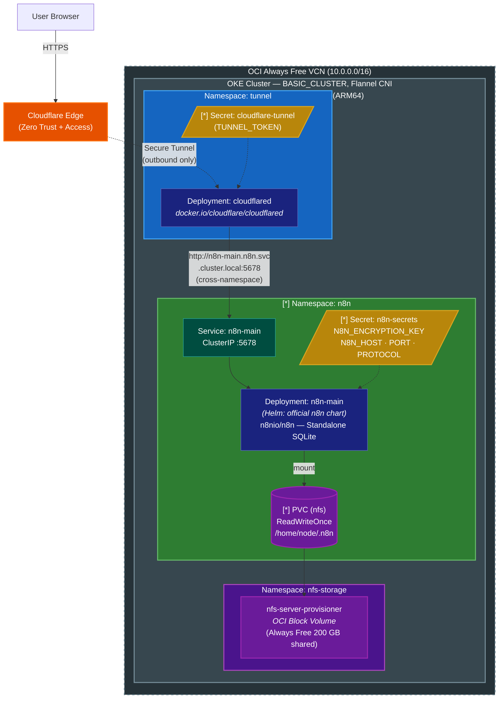

# n8n on OKE Always Free -- Cloudflare Zero Trust Tunnel Deployment Guide

Deploy [n8n](https://n8n.io) workflow automation platform on an OCI Always Free OKE cluster, securely accessed via Cloudflare Zero Trust Tunnel, **fully managed by Terraform**, at zero additional cost.

> **Helm Chart**: n8n official — `oci://ghcr.io/n8n-io/n8n-helm-chart/n8n`
> **Source**: [github.com/n8n-io/n8n-hosting](https://github.com/n8n-io/n8n-hosting)

---

<!-- ──────────────── Table of Contents ──────────────── -->

## Table of Contents

- [Architecture Overview](#architecture-overview)
- [Prerequisites](#prerequisites)
- [Deployment Steps](#deployment-steps)
  - [Step 1: Create Cloudflare Tunnel](#step-1-create-cloudflare-tunnel)
  - [Step 2: Configure terraform.tfvars](#step-2-configure-terraformtfvars)
  - [Step 3: Run Terraform Apply](#step-3-run-terraform-apply)
  - [Step 4: Verify Deployment](#step-4-verify-deployment)
  - [Step 5: Configure Cloudflare Access Policy](#step-5-configure-cloudflare-access-policy)
- [Post-Deployment Recommendations](#post-deployment-recommendations)
- [Important Notes](#important-notes)
- [Troubleshooting](#troubleshooting)
- [Backup and Restore](#backup-and-restore)
- [Uninstall / Cleanup](#uninstall--cleanup)

---

<!-- ──────────────── Architecture Overview ──────────────── -->

## Architecture Overview

### Architecture Diagram



### Traffic Path

```
User ──HTTPS──> Cloudflare Public Hostname
     ──Tunnel──> cloudflared Pod (outbound only, no inbound port)
     ──HTTP────> n8n-main Service (ClusterIP, cluster internal)
     ──────────> n8n Pod (:5678)
```

### Data Path

```
n8n Pod ──mount──▶ NFS PVC ──▶ nfs-server-provisioner ──▶ OCI Block Volume
```

### Architecture Decisions

| Decision | Choice | Rationale |
|----------|--------|-----------|
| **Ingress Method** | Cloudflare Tunnel (not OCI LB) | OCI LB is not Always Free; ClusterIP + cloudflared achieves zero cost with equivalent security |
| **Helm Chart** | n8n official chart | Maintained by the official team; natively supports Standalone mode |
| **Execution Mode** | Standalone (SQLite) | No external PostgreSQL/Redis required; suitable for Always Free single-node |
| **cloudflared Deployment** | Separate Deployment (`tunnel` namespace) | Shared Tunnel service usable by any in-cluster service; official chart does not support `extraContainers` |
| **Persistence** | NFS StorageClass | Uses the existing nfs-server-provisioner; data stored on OCI Block Volume |
| **Secrets Management** | Terraform-managed (`kubernetes_secret_v1` in root `main.tf`); stored in Terraform state but marked as sensitive | Single-pane Terraform management of all resources; sensitive marking prevents values from appearing in plan output |

### Dual-Layer Authentication Architecture

n8n employs two layers of authentication for security:

1. **Cloudflare Access (network gateway layer)** -- Authenticates traffic before it reaches the cluster (e.g. restricting to `@your-domain.com` emails)
2. **n8n built-in authentication (application layer)** -- n8n creates an owner account on first launch; all users must log in

---

<!-- ──────────────── Prerequisites ──────────────── -->

## Prerequisites

| Item | Description |
|------|-------------|
| **Terraform** | >= 1.5.0, with OCI, Helm, and Kubernetes providers installed |
| **OCI CLI** | Installed and configured with a config profile (required for Helm/Kubernetes provider auth) |
| **kubectl** | Configured to connect to the OKE cluster (`oci ce cluster create-kubeconfig ...`) |
| **Cloudflare Account** | Owns a domain added to Cloudflare (Free plan is sufficient) |
| **NFS Storage** | `enable_nfs_storage = true` has been applied (n8n requires the NFS StorageClass) |

Verify cluster connectivity:

```bash
kubectl get nodes
# Should show an ARM64 worker node with STATUS Ready
```

---

<!-- ──────────────── Deployment Steps ──────────────── -->

## Deployment Steps

### Step 1: Create Cloudflare Tunnel

1. Go to [Cloudflare Zero Trust Dashboard](https://one.dash.cloudflare.com)
2. Navigate to **Networks -> Tunnels -> Create a tunnel**
3. Select **Cloudflared** connector
4. Enter a tunnel name (e.g. `n8n-oke`)
5. **Skip** the Install connector page (we will deploy cloudflared via Kubernetes)
6. Copy the **Tunnel Token** (needed in later steps)
7. Add a **Public Hostname**:

   | Field | Value | Description |
   |-------|-------|-------------|
   | Subdomain | `n8n` | Your desired subdomain |
   | Domain | `your-domain.com` | Your Cloudflare domain |
   | Type | `HTTP` | n8n uses HTTP internally |
   | URL | `n8n-main.n8n.svc.cluster.local:5678` | Cross-namespace fully qualified FQDN |

   > [!] The Service URL must be set to `n8n-main.n8n.svc.cluster.local:5678`.
   > Since cloudflared is in the `tunnel` namespace, the full FQDN is required to access the Service in the `n8n` namespace.

8. Save the configuration

---

### Step 2: Configure terraform.tfvars

Edit `terraform.tfvars` and fill in the following variables:

```hcl
enable_cloudflare_tunnel = true
cloudflare_tunnel_token  = "<Tunnel Token copied from the Cloudflare Dashboard>"

enable_n8n               = true
n8n_host                 = "n8n.your-domain.com"
n8n_encryption_key       = "<openssl rand -hex 32>"
```

Generate an encryption key:

```bash
openssl rand -hex 32
```

> [!] **Be sure to back up `n8n_encryption_key` to a safe location!** If this key is lost, all third-party credentials stored in n8n (such as API keys, OAuth tokens) cannot be decrypted.

Available variables:

| Variable | Type | Default | Description |
|----------|------|---------|-------------|
| `enable_n8n` | bool | `false` | Whether to deploy n8n (requires cloudflare_tunnel to also be enabled) |
| `n8n_host` | string | -- | n8n external hostname (must match the Cloudflare Public Hostname) |
| `n8n_encryption_key` | string | -- | n8n encryption key (see generation method above) |
| `n8n_pvc_size` | string | `"5Gi"` | NFS PVC size (SQLite DB + workflows) |
| `n8n_chart_version` | string | `null` | Helm chart version (null = latest) |
| `enable_cloudflare_tunnel` | bool | `false` | Whether to deploy the shared Cloudflare Tunnel |
| `cloudflare_tunnel_token` | string | -- | Cloudflare Tunnel Token |

---

### Step 3: Run Terraform Apply

```bash
# Preview changes
terraform plan

# Apply changes
terraform apply
```

Terraform will create the following resources:

- `kubernetes_namespace_v1.n8n` -- n8n namespace
- `kubernetes_namespace_v1.tunnel` -- tunnel namespace
- `kubernetes_secret_v1.n8n_secrets` -- n8n core configuration Secret
- `kubernetes_secret_v1.cloudflare_tunnel` -- Cloudflare Tunnel token Secret
- `kubernetes_persistent_volume_claim_v1.n8n_data` -- NFS PVC (name: `n8n-data`)
- `helm_release.n8n[0]` -- n8n Helm release (Standalone mode, SQLite)
- `kubernetes_deployment_v1.cloudflared[0]` -- cloudflared Tunnel Deployment

> NOTE: The `n8n` and `tunnel` namespaces and the PVC are always created regardless of whether `enable_n8n` / `enable_cloudflare_tunnel` is enabled.

---

### Step 4: Verify Deployment

```bash
# Check n8n Pod status
kubectl get pods -n n8n
# Expected output:
#   NAME                          READY   STATUS    RESTARTS   AGE
#   n8n-main-xxxxxxxxxx-xxxxx     1/1     Running   0          2m

# Check cloudflared Pod status (in tunnel namespace)
kubectl get pods -n tunnel
# Expected output:
#   NAME                           READY   STATUS    RESTARTS   AGE
#   cloudflared-xxxxxxxxxx-xxxxx   1/1     Running   0          2m

# Confirm PVC is Bound
kubectl get pvc -n n8n

# View n8n logs (confirm successful startup)
kubectl logs -n n8n deployment/n8n-main

# View cloudflared connection status (should show tunnel is connected)
kubectl logs -n tunnel deployment/cloudflared

# Confirm Service is created
kubectl get svc -n n8n
# Expected output:
#   NAME       TYPE        CLUSTER-IP      EXTERNAL-IP   PORT(S)    AGE
#   n8n-main   ClusterIP   10.96.xxx.xxx   <none>        5678/TCP   2m
```

Open a browser and navigate to the Public Hostname configured in Step 1:

```
https://n8n.your-domain.com
```

On first access, n8n will prompt you to create an **owner account** (set email and password). This account becomes the administrator.

> NOTE: Cloudflare automatically handles HTTPS/TLS termination. n8n internal communication uses HTTP; no additional certificate configuration is needed.

---

### Step 5: Configure Cloudflare Access Policy

It is recommended to add Cloudflare Access as a first line of defense in addition to n8n's built-in authentication:

1. Go to [Cloudflare Zero Trust Dashboard](https://one.dash.cloudflare.com)
2. Navigate to **Access -> Applications -> Add an application**
3. Select **Self-hosted**
4. Configure the Application:

   | Field | Value |
   |-------|-------|
   | Application name | `n8n` |
   | Application domain | `n8n.your-domain.com` |

5. Add a **Policy**:

   | Field | Value |
   |-------|-------|
   | Policy name | `Allow organization email` |
   | Action | `Allow` |
   | Include rule | Emails ending in `@your-domain.com` |

   > Example: If your organization email domain is `@lcse.org`, set "Emails ending in" = `@lcse.org`.
   > This way, only users with that email domain who pass OTP verification can access n8n.

6. Save the configuration

**Authentication flow (user perspective):**

```
User accesses https://n8n.your-domain.com
    -> Cloudflare Access intercepts: enter email -> receive OTP code -> verification passes
    -> Enter n8n login page: enter n8n account credentials
    -> Successfully access n8n workspace
```

---

<!-- ──────────────── Post-Deployment Recommendations ──────────────── -->

## Post-Deployment Recommendations

### Change PV Reclaim Policy to Retain

The default reclaim policy is `Delete`, meaning when a PVC is deleted, the PV and its data are also deleted. It is recommended to change it to `Retain`:

```bash
# Find the PV name corresponding to the n8n PVC
PV_NAME=$(kubectl get pvc -n n8n -o jsonpath='{.items[0].spec.volumeName}')

# Change the reclaim policy to Retain
kubectl patch pv "$PV_NAME" -p '{"spec":{"persistentVolumeReclaimPolicy":"Retain"}}'

# Verify
kubectl get pv "$PV_NAME" -o jsonpath='{.spec.persistentVolumeReclaimPolicy}'
# Should show: Retain
```

---

<!-- ──────────────── Important Notes ──────────────── -->

## Important Notes

### N8N_ENCRYPTION_KEY Backup

`n8n_encryption_key` (configured in `terraform.tfvars`) is the key n8n uses to encrypt all stored third-party credentials. **Be sure to back it up securely**; if lost, all stored API keys, OAuth tokens, etc. cannot be decrypted.

### NFS Persistent Storage

- n8n data (SQLite DB, workflows, credentials) is stored on an NFS PVC, mounted at `/home/node/.n8n`
- NFS is provided by `nfs-server-provisioner` (namespace: `nfs-storage`), backed by OCI Block Volume
- The backing block volume is formatted as **XFS with project quotas enabled** (`--enable-xfs-quota`); each PVC's `requests.storage` becomes a hard quota — Pods cannot exceed it even when the underlying volume has free space
- It is recommended to change the PV reclaim policy to `Retain` immediately after deployment (see steps above)

#### Verify XFS quotas are active

```bash
NFS_POD=$(kubectl -n nfs-storage get pod -l app=nfs-server-provisioner -o jsonpath='{.items[0].metadata.name}')
kubectl -n nfs-storage exec "$NFS_POD" -- xfs_quota -x -c 'report -h' /export
# Expect one line per PVC; "Hard" column should match the PVC's requests.storage
```

#### Re-formatting the NFS volume (one-time migration, destructive)

If an existing deployment still has an `ext4` backing volume (the chart default
prior to this repo enabling XFS), a one-time re-format is required to activate
quotas. **This deletes all PVC data on the NFS volume** — back up first.

```bash
# 1. Back up data, then scale the provisioner down
kubectl -n nfs-storage scale statefulset nfs-server-provisioner --replicas=0

# 2. SSH to the worker node and re-format the OCI block volume as XFS
sudo umount /var/lib/kubelet/plugins/...   # path of the NFS PV
sudo mkfs.xfs -f -L nfs-data /dev/oracleoci/oraclevdb
echo 'LABEL=nfs-data /mnt/nfs xfs defaults,prjquota 0 0' | sudo tee -a /etc/fstab
sudo mount -a

# 3. Scale the provisioner back up; restore data into the new PVCs
kubectl -n nfs-storage scale statefulset nfs-server-provisioner --replicas=1
```

### n8n PVC Is a Permanent Resource

The n8n PVC (`n8n-data`) is a permanent resource -- it will not be deleted even when `enable_n8n = false`, protecting stored data. For complete removal, see [Uninstall / Cleanup](#uninstall--cleanup).

### Always Free Resource Limits

n8n + cloudflared **do not consume additional** OCI Always Free infrastructure quota (they use the existing node's CPU/RAM):

| Resource | n8n Usage | cloudflared Usage | Always Free Limit |
|----------|-----------|-------------------|-------------------|
| CPU | 100m-500m | 10m-100m | 4 OCPU total |
| RAM | 256Mi-512Mi | 32Mi-128Mi | 24 GB total |
| Block Volume | +0 (NFS PVC) | +0 | 200 GB shared |
| Load Balancer | 0 (ClusterIP) | 0 | N/A |

### Secrets in Terraform State (Marked as Sensitive)

Kubernetes Secrets are managed by Terraform `kubernetes_secret_v1` resources and **are stored in `terraform.tfstate`**, but all sensitive fields are marked as `sensitive` and will not appear in `terraform plan`/`apply` output. Safeguard the state file, or use a remote backend (e.g. OCI Object Storage).

### Cloudflare Handles TLS

- Cloudflare Edge terminates HTTPS; in-cluster communication uses HTTP
- `N8N_PROTOCOL` is set to `http`; no TLS certificate configuration is needed on the n8n side
- cloudflared establishes **outbound-only** connections (HTTPS port 443); no inbound ports are opened

---

<!-- ──────────────── Troubleshooting ──────────────── -->

## Troubleshooting

### Pod Status: ImagePullBackOff

**Problem**: OKE uses CRI-O as its container runtime. CRI-O **does not** automatically prepend `docker.io/`.

**Solution**: Ensure image names use fully qualified registry paths (fully qualified image names). This project already has the correct configuration in Terraform:

| Component | Correct Image Name |
|-----------|--------------------|
| n8n | `docker.n8n.io/n8nio/n8n:latest` |
| cloudflared | `docker.io/cloudflare/cloudflared:latest` |

If you deploy other images yourself, ensure you add the `docker.io/` prefix:

```yaml
# [ERROR] Incorrect (CRI-O cannot resolve)
image: nginx:latest

# [OK] Correct
image: docker.io/nginx:latest
```

### cloudflared Pod CrashLoopBackOff

**Possible causes**:

1. **TUNNEL_TOKEN is incorrect** -- Verify `cloudflare_tunnel_token` in `terraform.tfvars` matches the Cloudflare Dashboard
2. **Tunnel has been deleted** -- Check the Cloudflare Dashboard to confirm the tunnel still exists

```bash
# View cloudflared logs
kubectl logs -n tunnel deployment/cloudflared

# Verify the secret content exists
kubectl get secret cloudflare-tunnel -n tunnel -o jsonpath='{.data.TUNNEL_TOKEN}' | base64 -d
```

### n8n Pod Cannot Start (Pending Status)

**Possible causes**:

1. **PVC not Bound** -- NFS StorageClass is not yet ready

   ```bash
   # Check PVC status
   kubectl get pvc -n n8n

   # Check if nfs-server-provisioner is running
   kubectl get pods -n nfs-storage
   ```

2. **NFS storage not enabled** -- Confirm `enable_nfs_storage = true` has been applied

3. **Secret does not exist** -- Confirm Terraform apply completed without errors

   ```bash
   kubectl get secrets -n n8n
   ```

### Cloudflare Access OTP Verification Email Not Received

**Possible causes**:

1. **Email classified as spam** -- Check the spam folder
2. **Email domain not in the allow list** -- Verify the "Emails ending in" setting in the Access Policy is correct
3. **DNS not yet propagated** -- Newly created Public Hostnames may take a few minutes to take effect

### n8n Shows 502 Bad Gateway

**Possible cause**: n8n Pod has not finished starting, or the Service endpoint is incorrect

```bash
# Confirm n8n Pod is Running
kubectl get pods -n n8n -l app.kubernetes.io/name=n8n

# Verify Service endpoint
kubectl get endpoints -n n8n n8n-main

# Test in-cluster connectivity
kubectl run test-curl --rm -it --image=docker.io/curlimages/curl:latest -n n8n -- \
  curl -s http://n8n-main:5678/healthz
```

### Terraform Apply Error: enable_nfs_storage must be true

n8n depends on the NFS StorageClass for persistent storage. Ensure both are enabled in `terraform.tfvars`:

```hcl
enable_nfs_storage = true
enable_n8n         = true
```

---

<!-- ──────────────── Backup and Restore ──────────────── -->

## Backup and Restore

### Backup

The project root directory provides a `backup-n8n.sh` script for one-command backup of all critical n8n data:

```bash
# Use default namespaces (n8n + tunnel)
./backup-n8n.sh

# Custom namespaces
./backup-n8n.sh <n8n_namespace> <tunnel_namespace>
```

Backup contents:

| File | Description |
|------|-------------|
| `database.sqlite` | Complete n8n data (workflows, credentials, execution history, user accounts) |
| `n8n-secrets.yaml` | K8s Secret YAML (N8N_ENCRYPTION_KEY, etc.) |
| `cloudflare-tunnel.yaml` | Cloudflare Tunnel token YAML |
| `plaintext-keys.txt` | Plaintext keys (for storing in a password manager) |
| `helm-values.yaml` | n8n Helm release configuration values |

Backups are stored in `backups/YYYYMMDDHHMM/`, with a maximum of **7 copies** retained; the oldest is automatically rotated out when exceeded.

> [!] `backups/` is excluded by `.gitignore` and will not be committed to version control.

### Restore

To restore n8n data:

```bash
# 1. Restore the SQLite database
N8N_POD=$(kubectl get pod -n n8n -l app.kubernetes.io/name=n8n -o jsonpath='{.items[0].metadata.name}')
kubectl cp backups/<YYYYMMDDHHMM>/database.sqlite n8n/${N8N_POD}:/home/node/.n8n/database.sqlite

# 2. Restart n8n to read the restored database
kubectl rollout restart deployment/n8n-main -n n8n
```

> NOTE: Secrets (encryption key, Tunnel Token) are managed by Terraform. To update keys, modify `terraform.tfvars` and run `terraform apply`.

### Important Backup Notes

- **`n8n_encryption_key` is the most critical item to back up**: if lost, all stored third-party credentials cannot be decrypted
- It is recommended to run `./backup-n8n.sh` immediately after first deployment, and store the keys from `plaintext-keys.txt` in a password manager
- Before backing up, the script automatically runs `PRAGMA wal_checkpoint(TRUNCATE)` to ensure SQLite data consistency

---

<!-- ──────────────── Uninstall / Cleanup ──────────────── -->

## Uninstall / Cleanup

### Option 1: Disable n8n and Cloudflare Tunnel (preserve namespaces and PVCs)

Edit `terraform.tfvars`:

```hcl
enable_n8n               = false
enable_cloudflare_tunnel = false
```

Run Terraform:

```bash
terraform apply
```

This will remove `helm_release.n8n`, `kubernetes_deployment_v1.cloudflared`, and related Secrets. **Namespaces (`n8n`, `tunnel`) and the PVC (`n8n-data`) are preserved**; no data is lost.

### Option 2: Complete Removal (including namespaces and PVCs)

Namespaces and PVCs are permanent resources; `terraform destroy` will not delete them. They must be manually removed from state before deletion:

```bash
# 1. First disable the application layer (see Option 1)
terraform apply -var="enable_n8n=false" -var="enable_cloudflare_tunnel=false"

# 2. Remove from Terraform state
terraform state rm kubernetes_namespace_v1.n8n
terraform state rm kubernetes_namespace_v1.tunnel
terraform state rm kubernetes_persistent_volume_claim_v1.n8n_data

# 3. Manually delete Kubernetes resources
kubectl delete ns n8n tunnel
```

> [!] Deleting the namespace will also delete the PVC, permanently removing all n8n data (workflows, credentials, SQLite DB). Run a backup first.

(Optional) Remove the Cloudflare Tunnel:
- Go to Cloudflare Zero Trust Dashboard -> Networks -> Tunnels
- Delete the corresponding tunnel
