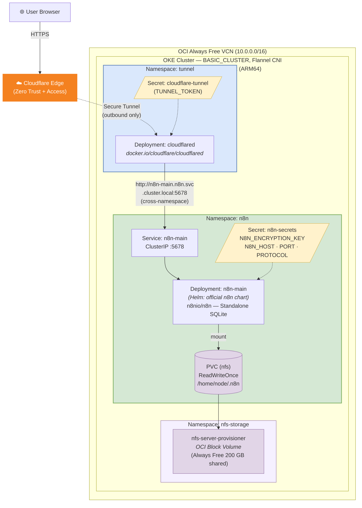

# n8n on OKE Always Free — Cloudflare Zero Trust Tunnel 部署指南

在 OCI Always Free OKE 叢集上部署 [n8n](https://n8n.io) 工作流自動化平台，透過 Cloudflare Zero Trust Tunnel 安全存取，**不產生任何額外費用**。

> **Helm Chart**: n8n 官方 — `oci://ghcr.io/n8n-io/n8n-helm-chart/n8n`
> **Source**: [github.com/n8n-io/n8n-hosting](https://github.com/n8n-io/n8n-hosting)

---

<!-- ──────────────── 目錄 ──────────────── -->

## 目錄

- [架構概覽](#架構概覽)
- [先決條件](#先決條件)
- [部署步驟](#部署步驟)
  - [Step 1：建立 Cloudflare Tunnel](#step-1建立-cloudflare-tunnel)
  - [Step 2：編輯 Kubernetes Manifest 檔案](#step-2編輯-kubernetes-manifest-檔案)
  - [Step 3：套用 Kubernetes Manifests](#step-3套用-kubernetes-manifests)
  - [Step 4：啟用 n8n（terraform.tfvars）](#step-4啟用-n8nterraformtfvars)
  - [Step 5：執行 Terraform Apply](#step-5執行-terraform-apply)
  - [Step 6：驗證部署](#step-6驗證部署)
  - [Step 7：透過 Cloudflare Tunnel 存取 n8n](#step-7透過-cloudflare-tunnel-存取-n8n)
  - [Step 8：設定 Cloudflare Access 存取原則](#step-8設定-cloudflare-access-存取原則)
- [部署後建議操作](#部署後建議操作)
- [重要注意事項](#重要注意事項)
- [疑難排解](#疑難排解)
- [備份與還原](#備份與還原)
- [解除安裝 / 清理](#解除安裝--清理)

---

<!-- ──────────────── 架構概覽 ──────────────── -->

## 架構概覽

### 架構圖



### 流量路徑

```
User ──HTTPS──▶ Cloudflare Public Hostname
     ──Tunnel──▶ cloudflared Pod (outbound only, 無 inbound port)
     ──HTTP────▶ n8n-main Service (ClusterIP, 叢集內部)
     ──────────▶ n8n Pod (:5678)
```

### 資料路徑

```
n8n Pod ──mount──▶ NFS PVC ──▶ nfs-server-provisioner ──▶ OCI Block Volume
```

### 架構決策

| 決策 | 選擇 | 原因 |
|------|------|------|
| **Ingress 方式** | Cloudflare Tunnel（非 OCI LB） | OCI LB 非 Always Free；ClusterIP + cloudflared 零成本且等效安全 |
| **Helm Chart** | n8n 官方 chart | 官方團隊維護，原生支援 Standalone mode |
| **運行模式** | Standalone（SQLite） | 不需外部 PostgreSQL/Redis，適合 Always Free 單節點 |
| **cloudflared 部署** | 獨立 Deployment（`tunnel` namespace） | 共享 Tunnel 服務，可供叢集內任何服務使用；官方 chart 不支援 `extraContainers` |
| **持久化** | NFS StorageClass | 使用既有 nfs-server-provisioner，資料儲存於 OCI Block Volume |
| **Secrets 管理** | kubectl 手動建立（不進 Terraform state） | 避免敏感資料存入 state 檔案 |

### 雙層認證架構

n8n 採用兩層認證以確保安全：

1. **Cloudflare Access（網路閘道層）** — 在流量到達叢集前進行身份驗證（如限制 `@your-domain.com` 信箱）
2. **n8n 內建認證（應用層）** — n8n 首次啟動時會建立 owner 帳號，所有使用者都需登入

---

<!-- ──────────────── 先決條件 ──────────────── -->

## 先決條件

在開始之前，請確認以下項目已就緒：

| 項目 | 說明 |
|------|------|
| **OCI 帳號** | 已建立 Always Free OKE 叢集（本專案的 Terraform 已部署完成） |
| **kubectl** | 已設定好連線至 OKE 叢集（`oci ce cluster create-kubeconfig ...`） |
| **Terraform** | >= 1.2.0，已安裝 OCI、Helm、Kubernetes provider |
| **Cloudflare 帳號** | 擁有一個已加入 Cloudflare 的網域（Free plan 即可） |
| **OCI CLI** | 已安裝並設定好 config profile（Helm/Kubernetes provider 認證需要） |
| **NFS Storage** | `enable_nfs_storage = true` 已套用（n8n 需要 NFS StorageClass） |

驗證叢集連線：

```bash
kubectl get nodes
# 應顯示 ARM64 worker node，STATUS 為 Ready
```

---

<!-- ──────────────── 部署步驟 ──────────────── -->

## 部署步驟

### Step 1：建立 Cloudflare Tunnel

1. 前往 [Cloudflare Zero Trust Dashboard](https://one.dash.cloudflare.com)
2. 進入 **Networks → Tunnels → Create a tunnel**
3. 選擇 **Cloudflared** connector
4. 輸入 tunnel 名稱（例如 `n8n-oke`）
5. **跳過** Install connector 頁面（我們會透過 Kubernetes 部署 cloudflared）
6. 複製 **Tunnel Token**（後續步驟會用到）
7. 新增 **Public Hostname**：

   | 欄位 | 值 | 說明 |
   |------|----|------|
   | Subdomain | `n8n` | 你想要的子網域 |
   | Domain | `your-domain.com` | 你的 Cloudflare 網域 |
   | Type | `HTTP` | n8n 內部走 HTTP |
   | URL | `n8n-main.n8n.svc.cluster.local:5678` | 跨 namespace 完整 FQDN |

   > ⚠️ Service URL 必須設定為 `n8n-main.n8n.svc.cluster.local:5678`。
   > 因為 cloudflared 位於 `tunnel` namespace，必須使用完整 FQDN 來存取 `n8n` namespace 中的 Service。

8. 儲存設定

---

### Step 2：編輯 Kubernetes Manifest 檔案

本目錄下有三個 manifest 檔案需要編輯：

#### 2a. `namespace.yaml` — 無需修改

```yaml
apiVersion: v1
kind: Namespace
metadata:
  name: n8n
  labels:
    app.kubernetes.io/part-of: n8n
```

此檔案建立 `n8n` namespace，直接使用即可。

#### 2b. `n8n-secrets.yaml` — 填入 n8n 核心設定

```yaml
apiVersion: v1
kind: Secret
metadata:
  name: n8n-secrets
  namespace: n8n
  labels:
    app.kubernetes.io/part-of: n8n
type: Opaque
stringData:
  N8N_ENCRYPTION_KEY: "<你的加密金鑰>"    # 見下方生成方式
  N8N_HOST: "n8n.your-domain.com"          # Cloudflare Public Hostname
  N8N_PORT: "5678"                          # n8n 監聽 port（通常不需修改）
  N8N_PROTOCOL: "http"                      # 叢集內部走 HTTP（Cloudflare 處理 TLS）
```

各欄位說明：

| Key | 說明 | 範例值 |
|-----|------|--------|
| `N8N_ENCRYPTION_KEY` | 用於加密 n8n 中儲存的所有第三方憑證（API key、OAuth token 等）。**遺失不可恢復** | `REDACTED_PREFIX...`（64 字元 hex） |
| `N8N_HOST` | n8n 對外 URL 的主機名稱，需與 Cloudflare Public Hostname 一致 | `n8n.your-domain.com` |
| `N8N_PORT` | n8n 內部監聽的 port | `5678` |
| `N8N_PROTOCOL` | n8n 內部協定。因 TLS 由 Cloudflare 終止，此處為 `http` | `http` |

生成 encryption key：

```bash
openssl rand -hex 32
# 輸出範例：REDACTED_N8N_ENCRYPTION_KEY
```

> ⚠️ **務必將 `N8N_ENCRYPTION_KEY` 備份到安全的地方！** 此金鑰一旦遺失，所有已儲存在 n8n 中的第三方憑證（如 API key、OAuth token）將無法解密。

#### 2c. `cloudflare-tunnel-secret.yaml` — 填入 Tunnel Token

```yaml
apiVersion: v1
kind: Secret
metadata:
  name: cloudflare-tunnel
  namespace: tunnel
type: Opaque
stringData:
  TUNNEL_TOKEN: "<你的 Cloudflare Tunnel Token>"
```

| Key | 說明 |
|-----|------|
| `TUNNEL_TOKEN` | 在 Step 1 從 Cloudflare Dashboard 複製的 tunnel token（以 `eyJ` 開頭的 base64 字串） |

---

### Step 3：套用 Kubernetes Manifests

依序執行以下指令：

```bash
# 建立 tunnel namespace（Cloudflare Tunnel 共用）
kubectl apply -f k8s/tunnel-namespace.yaml

# 建立 n8n namespace
kubectl apply -f k8s/namespace.yaml

# 建立 Cloudflare Tunnel token secret（tunnel namespace）
kubectl apply -f k8s/cloudflare-tunnel-secret.yaml

# 建立 n8n 核心 secrets（n8n namespace）
kubectl apply -f k8s/n8n-secrets.yaml
```

驗證 secrets 已建立：

```bash
kubectl get secrets -n tunnel
# 預期輸出：
#   NAME                TYPE     DATA   AGE
#   cloudflare-tunnel   Opaque   1      10s

kubectl get secrets -n n8n
# 預期輸出：
#   NAME                TYPE     DATA   AGE
#   n8n-secrets         Opaque   4      5s
```

---

### Step 4：啟用 n8n（terraform.tfvars）

編輯 `terraform.tfvars`，設定以下變數：

```hcl
# NFS Storage（n8n 依賴此功能）
enable_nfs_storage     = true
nfs_volume_size_in_gbs = 136    # Boot (64 GB) + NFS (136 GB) = 200 GB Always Free limit

# n8n
enable_n8n = true

# 以下為選填，使用預設值即可：
# n8n_namespace           = "n8n"
# n8n_pvc_size            = "5Gi"
# n8n_secret_name         = "n8n-secrets"
# cloudflared_secret_name = "cloudflare-tunnel"
# n8n_chart_version       = null     # null = 最新版
```

可用變數一覽：

| 變數 | 類型 | 預設值 | 說明 |
|------|------|--------|------|
| `enable_n8n` | bool | `false` | 是否部署 n8n（需同時啟用 cloudflare_tunnel） |
| `n8n_namespace` | string | `"n8n"` | n8n 部署的 Kubernetes namespace |
| `n8n_pvc_size` | string | `"5Gi"` | NFS PVC 大小（SQLite DB + workflows） |
| `n8n_secret_name` | string | `"n8n-secrets"` | 含核心設定的 K8s Secret 名稱 |
| `cloudflared_secret_name` | string | `"cloudflare-tunnel"` | 含 TUNNEL_TOKEN 的 K8s Secret 名稱 |
| `n8n_chart_version` | string | `null` | Helm chart 版本（null = latest） |
| `enable_cloudflare_tunnel` | bool | `false` | 是否部署共享 Cloudflare Tunnel |
| `cloudflare_tunnel_namespace` | string | `"tunnel"` | Cloudflare Tunnel 部署的 Kubernetes namespace |

---

### Step 5：執行 Terraform Apply

```bash
# 如果是首次啟用 n8n，需重新初始化以下載 kubernetes provider
terraform init

# 預覽變更
terraform plan

# 套用變更
terraform apply
```

Terraform 會建立以下資源：

- `helm_release.n8n[0]` — n8n Helm release（Standalone mode, SQLite, NFS PVC）
- `kubernetes_deployment_v1.cloudflared[0]` — cloudflared Tunnel Deployment

> 💡 如果 `enable_nfs_storage` 為 `false`，Terraform 會在 precondition 檢查時報錯並中止，不會建立任何資源。

---

### Step 6：驗證部署

```bash
# 確認 n8n Pod 狀態
kubectl get pods -n n8n
# 預期輸出：
#   NAME                          READY   STATUS    RESTARTS   AGE
#   n8n-main-xxxxxxxxxx-xxxxx     1/1     Running   0          2m

# 確認 cloudflared Pod 狀態（在 tunnel namespace）
kubectl get pods -n tunnel
# 預期輸出：
#   NAME                           READY   STATUS    RESTARTS   AGE
#   cloudflared-xxxxxxxxxx-xxxxx   1/1     Running   0          2m

# 確認 PVC 已 Bound
kubectl get pvc -n n8n

# 查看 n8n 日誌（確認啟動成功）
kubectl logs -n n8n deployment/n8n-main

# 查看 cloudflared 連線狀態（應顯示 tunnel 已連線）
kubectl logs -n tunnel deployment/cloudflared

# 確認 Service 已建立
kubectl get svc -n n8n
# 預期輸出：
#   NAME       TYPE        CLUSTER-IP      EXTERNAL-IP   PORT(S)    AGE
#   n8n-main   ClusterIP   10.96.xxx.xxx   <none>        5678/TCP   2m
```

---

### Step 7：透過 Cloudflare Tunnel 存取 n8n

開啟瀏覽器，前往你在 Step 1 設定的 Public Hostname：

```
https://n8n.your-domain.com
```

首次存取時，n8n 會要求你建立 **owner 帳號**（設定 email 和密碼）。此帳號即為管理員。

> 💡 Cloudflare 自動處理 HTTPS/TLS 終止。n8n 內部通訊使用 HTTP，不需額外設定憑證。

---

### Step 8：設定 Cloudflare Access 存取原則

建議在 n8n 內建認證之外，再加上 Cloudflare Access 作為第一道防線：

1. 前往 [Cloudflare Zero Trust Dashboard](https://one.dash.cloudflare.com)
2. 進入 **Access → Applications → Add an application**
3. 選擇 **Self-hosted**
4. 設定 Application：

   | 欄位 | 值 |
   |------|----|
   | Application name | `n8n` |
   | Application domain | `n8n.your-domain.com` |

5. 新增 **Policy**：

   | 欄位 | 值 |
   |------|----|
   | Policy name | `Allow organization email` |
   | Action | `Allow` |
   | Include rule | Emails ending in `@your-domain.com` |

   > 範例：若你的組織 email 為 `@lcse.org`，設定 "Emails ending in" = `@lcse.org`。
   > 這樣只有該網域信箱通過 OTP 驗證後才能存取 n8n。

6. 儲存設定

**認證流程（使用者視角）：**

```
使用者存取 https://n8n.your-domain.com
    → Cloudflare Access 攔截：輸入 email → 收到 OTP 驗證碼 → 驗證通過
    → 進入 n8n 登入頁面：輸入 n8n 帳號密碼
    → 成功進入 n8n 工作區
```

---

<!-- ──────────────── 部署後建議操作 ──────────────── -->

## 部署後建議操作

### 將 PV Reclaim Policy 改為 Retain

預設的 reclaim policy 為 `Delete`，當 PVC 被刪除時，PV 和資料也會一同刪除。建議改為 `Retain`：

```bash
# 查看 n8n PVC 對應的 PV 名稱
PV_NAME=$(kubectl get pvc -n n8n -o jsonpath='{.items[0].spec.volumeName}')

# 將 reclaim policy 改為 Retain
kubectl patch pv "$PV_NAME" -p '{"spec":{"persistentVolumeReclaimPolicy":"Retain"}}'

# 驗證
kubectl get pv "$PV_NAME" -o jsonpath='{.spec.persistentVolumeReclaimPolicy}'
# 應顯示: Retain
```

---

<!-- ──────────────── 重要注意事項 ──────────────── -->

## 重要注意事項

### N8N_ENCRYPTION_KEY 備份

`N8N_ENCRYPTION_KEY` 是 n8n 用來加密所有儲存的第三方憑證的金鑰。**請務必妥善備份**，遺失後所有已儲存的 API key、OAuth token 等均無法解密。

### NFS 持久化儲存

- n8n 資料（SQLite DB、workflows、credentials）儲存於 NFS PVC，掛載路徑為 `/home/node/.n8n`
- NFS 由 `nfs-server-provisioner`（namespace: `nfs-storage`）提供，底層使用 OCI Block Volume
- 建議部署後立即將 PV reclaim policy 改為 `Retain`（見上方步驟）

### Always Free 資源限制

n8n + cloudflared **不額外消耗** OCI Always Free 基礎設施配額（使用既有節點的 CPU/RAM）：

| 資源 | n8n 用量 | cloudflared 用量 | Always Free 限制 |
|------|---------|-----------------|-----------------|
| CPU | 100m–500m | 10m–100m | 4 OCPU total |
| RAM | 256Mi–512Mi | 32Mi–128Mi | 24 GB total |
| Block Volume | +0（NFS PVC） | +0 | 200 GB shared |
| Load Balancer | 0（ClusterIP） | 0 | 不適用 |

### Secrets 不進入 Terraform State

Kubernetes Secrets 以 `kubectl apply` 手動建立，**不由 Terraform 管理**，因此敏感資料不會出現在 `terraform.tfstate` 中。

### Cloudflare 處理 TLS

- Cloudflare Edge 終止 HTTPS，叢集內部通訊使用 HTTP
- `N8N_PROTOCOL` 設為 `http`，無需在 n8n 端設定 TLS 憑證
- cloudflared 僅建立 **outbound** 連線（HTTPS port 443），不開啟任何 inbound port

---

<!-- ──────────────── 疑難排解 ──────────────── -->

## 疑難排解

### Pod 狀態為 ImagePullBackOff

**問題**：OKE 使用 CRI-O 作為 container runtime，CRI-O **不會**自動加上 `docker.io/` 前綴。

**解法**：確認 image 名稱使用完整的 registry 路徑（fully qualified image name）。本專案已在 Terraform 中正確設定：

| 元件 | 正確 image 名稱 |
|------|-----------------|
| n8n | `docker.n8n.io/n8nio/n8n:latest` |
| cloudflared | `docker.io/cloudflare/cloudflared:latest` |

如果你自行部署其他 image，請確保加上 `docker.io/` 前綴：

```yaml
# ❌ 錯誤（CRI-O 無法解析）
image: nginx:latest

# ✅ 正確
image: docker.io/nginx:latest
```

### cloudflared Pod CrashLoopBackOff

**可能原因**：

1. **TUNNEL_TOKEN 不正確** — 確認 `cloudflare-tunnel-secret.yaml` 中的 token 與 Cloudflare Dashboard 一致
2. **Tunnel 已被刪除** — 至 Cloudflare Dashboard 確認 tunnel 仍然存在

```bash
# 查看 cloudflared 日誌
kubectl logs -n tunnel deployment/cloudflared

# 確認 secret 內容存在
kubectl get secret cloudflare-tunnel -n tunnel -o jsonpath='{.data.TUNNEL_TOKEN}' | base64 -d
```

### n8n Pod 無法啟動（Pending 狀態）

**可能原因**：

1. **PVC 未 Bound** — NFS StorageClass 尚未就緒

   ```bash
   # 檢查 PVC 狀態
   kubectl get pvc -n n8n

   # 檢查 nfs-server-provisioner 是否運行中
   kubectl get pods -n nfs-storage
   ```

2. **NFS storage 未啟用** — 確認 `enable_nfs_storage = true` 已套用

3. **Secret 不存在** — 確認已執行 Step 3

   ```bash
   kubectl get secrets -n n8n
   ```

### Cloudflare Access OTP 驗證信未收到

**可能原因**：

1. **Email 被歸類為垃圾郵件** — 檢查垃圾郵件匣
2. **Email 網域不在允許列表** — 確認 Access Policy 中 "Emails ending in" 設定正確
3. **DNS 尚未生效** — 新建立的 Public Hostname 可能需要幾分鐘生效

### n8n 顯示 502 Bad Gateway

**可能原因**：n8n Pod 尚未完成啟動，或 Service endpoint 不正確

```bash
# 確認 n8n Pod 已 Running
kubectl get pods -n n8n -l app.kubernetes.io/name=n8n

# 確認 Service endpoint
kubectl get endpoints -n n8n n8n-main

# 測試叢集內連線
kubectl run test-curl --rm -it --image=docker.io/curlimages/curl:latest -n n8n -- \
  curl -s http://n8n-main:5678/healthz
```

### Terraform apply 報錯：enable_nfs_storage must be true

n8n 依賴 NFS StorageClass 作為持久化儲存，請確認在 `terraform.tfvars` 中同時啟用：

```hcl
enable_nfs_storage = true
enable_n8n         = true
```

---

<!-- ──────────────── 備份與還原 ──────────────── -->

## 備份與還原

### 備份

專案根目錄提供 `backup-n8n.sh` 腳本，一鍵備份所有 n8n 關鍵資料：

```bash
# 使用預設 namespace（n8n + tunnel）
./backup-n8n.sh

# 自訂 namespace
./backup-n8n.sh <n8n_namespace> <tunnel_namespace>
```

備份內容：

| 檔案 | 說明 |
|------|------|
| `database.sqlite` | n8n 完整資料（workflows、credentials、執行記錄、使用者帳號） |
| `n8n-secrets.yaml` | K8s Secret YAML（N8N_ENCRYPTION_KEY 等） |
| `cloudflare-tunnel.yaml` | Cloudflare Tunnel token YAML |
| `plaintext-keys.txt` | 明文金鑰（方便存入密碼管理器） |
| `helm-values.yaml` | n8n Helm release 設定值 |

備份存放於 `backups/YYYYMMDDHHMM/`，最多保留 **7 份**，超過自動輪替刪除最舊的。

> ⚠️ `backups/` 已被 `.gitignore` 排除，不會進入版控。

### 還原

如果需要還原 n8n 資料：

```bash
# 1. 還原 K8s Secrets
kubectl apply -f backups/<YYYYMMDDHHMM>/n8n-secrets.yaml           # → n8n namespace
kubectl apply -f backups/<YYYYMMDDHHMM>/cloudflare-tunnel.yaml     # → tunnel namespace

# 2. 還原 SQLite 資料庫
N8N_POD=$(kubectl get pod -n n8n -l app.kubernetes.io/name=n8n -o jsonpath='{.items[0].metadata.name}')
kubectl cp backups/<YYYYMMDDHHMM>/database.sqlite n8n/${N8N_POD}:/home/node/.n8n/database.sqlite

# 3. 重啟 n8n 讓它讀取還原的資料庫
kubectl rollout restart deployment/n8n-main -n n8n
```

### 重要備份事項

- **`N8N_ENCRYPTION_KEY` 是最關鍵的備份項目**：遺失後所有已儲存的第三方憑證將無法解密
- 建議首次部署後立即執行 `./backup-n8n.sh`，並將 `plaintext-keys.txt` 中的金鑰存入密碼管理器
- 備份前腳本會自動執行 `PRAGMA wal_checkpoint(TRUNCATE)` 確保 SQLite 資料一致性

---

<!-- ──────────────── 解除安裝 / 清理 ──────────────── -->

## 解除安裝 / 清理

### 方式一：僅停用 n8n（保留其他基礎設施）

1. 修改 `terraform.tfvars`：

   ```hcl
   enable_n8n = false
   ```

2. 執行 Terraform：

   ```bash
   terraform apply
   ```

   這會移除 `helm_release.n8n` 和 `kubernetes_deployment_v1.cloudflared`。

3. 清理 Kubernetes Secrets 和 Namespace：

   ```bash
   kubectl delete -f k8s/cloudflare-tunnel-secret.yaml
   kubectl delete -f k8s/n8n-secrets.yaml
   kubectl delete -f k8s/namespace.yaml
   kubectl delete -f k8s/tunnel-namespace.yaml
   ```

4. （可選）移除 Cloudflare Tunnel：
   - 前往 Cloudflare Zero Trust Dashboard → Networks → Tunnels
   - 刪除對應的 tunnel

### 方式二：完整重設 n8n manifest 檔案

如果要重新部署，記得把 `n8n-secrets.yaml` 和 `cloudflare-tunnel-secret.yaml` 中的值改回 placeholder，避免不小心 commit 敏感資料：

```bash
# 還原 manifest 到 placeholder 值
git checkout -- k8s/n8n-secrets.yaml k8s/cloudflare-tunnel-secret.yaml
```

> ⚠️ 注意：`k8s/*.yaml` 檔案已加入 git。編輯時請確認不要把真實的 token 或 encryption key commit 進去。建議編輯後立即 apply，再用 `git checkout` 還原。

---

<!-- ──────────────── 檔案結構參考 ──────────────── -->

## 檔案結構參考

```
k8s/
├── README.md                       ← 本文件
├── tunnel-namespace.yaml           ← tunnel namespace（無需修改）
├── namespace.yaml                  ← n8n namespace（無需修改）
├── cloudflare-tunnel-secret.yaml   ← Cloudflare Tunnel Token Secret（需手動編輯）
└── n8n-secrets.yaml                ← n8n 核心設定 Secret（需手動編輯）

backup-n8n.sh                       ← 備份腳本（專案根目錄）
backups/                            ← 備份輸出目錄（gitignored）

# Terraform 管理的資源（不需手動建立）：
# main.tf → helm_release.n8n[0]                       Helm: n8n 官方 chart（n8n namespace）
# main.tf → kubernetes_deployment_v1.cloudflared[0]    Deployment: cloudflared（tunnel namespace）
```
