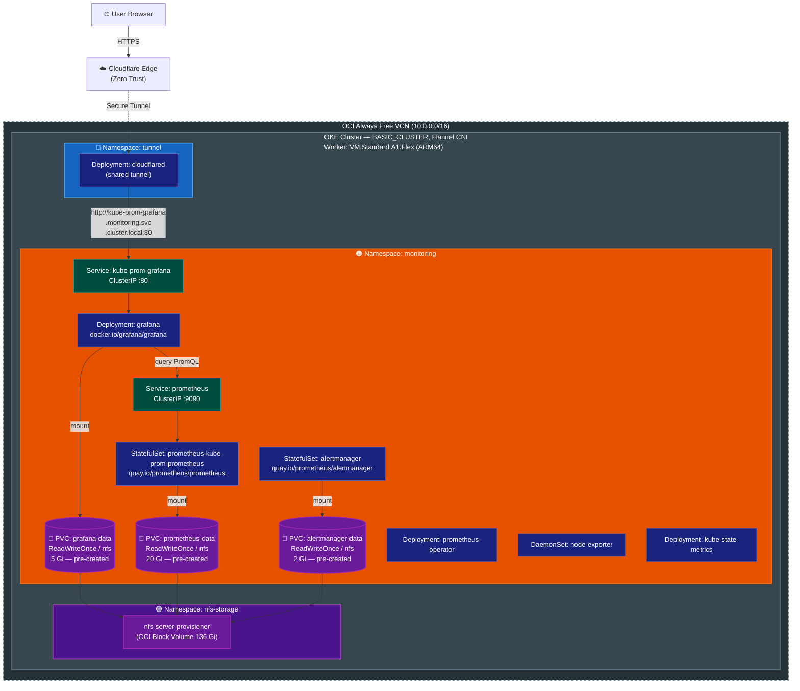

# Self-hosted Grafana + Prometheus on OKE Always Free

Deploy a fully self-hosted monitoring stack — **kube-prometheus-stack** — on an OCI Always Free ARM64 OKE cluster. Grafana is exposed via the existing Cloudflare Zero Trust Tunnel. All metric and dashboard data persists on the NFS `StorageClass`, surviving `helm uninstall`.

> **Helm Chart**: `prometheus-community/kube-prometheus-stack`
> **Coexists with**: `modules/monitoring` (Grafana Alloy → Grafana Cloud, optional)

---

## Table of Contents

- [Architecture Overview](#architecture-overview)
- [Prerequisites](#prerequisites)
- [Deployment Steps](#deployment-steps)
  - [Step 1: Pre-create Namespace and PVCs](#step-1-pre-create-namespace-and-pvcs)
  - [Step 2: Add Helm Repository](#step-2-add-helm-repository)
  - [Step 3: Install the Stack](#step-3-install-the-stack)
  - [Step 4: Configure Cloudflare Tunnel Public Hostname](#step-4-configure-cloudflare-tunnel-public-hostname)
  - [Step 5: Verify Deployment](#step-5-verify-deployment)
  - [Step 6: Set PV Reclaim Policy to Retain](#step-6-set-pv-reclaim-policy-to-retain)
- [Upgrades and Reinstallation](#upgrades-and-reinstallation)
- [Online PVC Expansion](#online-pvc-expansion)
- [Resource and Storage Allocation](#resource-and-storage-allocation)
- [Troubleshooting](#troubleshooting)
- [Teardown](#teardown)

---

## Architecture Overview



### Traffic Path

```
User ──HTTPS──▶ Cloudflare Public Hostname (grafana.your-domain.com)
     ──Tunnel──▶ cloudflared Pod (outbound-only, namespace: tunnel)
     ──HTTP────▶ kube-prom-grafana Service (ClusterIP, namespace: monitoring)
     ──────────▶ Grafana Pod (:3000 → exposed on :80)
```

### PVC Persistence Model

| PVC | Manifest | Survives `helm uninstall`? |
|-----|---------|--------------------------|
| `grafana-data` | `pvc-grafana.yaml` (pre-created) | ✅ Not managed by Helm |
| `prometheus-data` | `pvc-prometheus.yaml` (pre-created) | ✅ Not managed by Helm |
| `alertmanager-data` | `pvc-alertmanager.yaml` (pre-created) | ✅ Not managed by Helm |

> All three PVCs are pre-created independently of Helm and survive `helm uninstall`.

---

## Prerequisites

| Requirement | Details |
|-------------|---------|
| **kubectl** | Configured to connect to the OKE cluster |
| **Helm** | >= 3.0.0 |
| **NFS StorageClass** | `enable_nfs_storage = true` applied via Terraform (`storageClassName: nfs` must exist) |
| **Cloudflare Tunnel** | `enable_cloudflare_tunnel = true` applied via Terraform (the shared `cloudflared` Deployment must be running) |

> **Namespace conflict note**: If `enable_alloy_to_grafana_cloud = true` is already applied via Terraform, the `monitoring` namespace is Terraform-managed. In that case, **skip** `kubectl apply -f namespace.yaml` — the namespace already exists and Terraform owns it. Applying the manifest would cause label drift that Terraform would overwrite on the next `plan`/`apply`.

Verify cluster connectivity and NFS availability:

```bash
kubectl get nodes
# Expected: ARM64 worker node in Ready state

kubectl get storageclass nfs
# Expected: nfs storageclass listed
```

---

## Deployment Steps

### Step 1: Pre-create Namespace and PVCs

All three PVCs are pre-created independently of Helm so that `helm uninstall` never touches the persistent data.

```bash
# Skip namespace.yaml if enable_alloy_to_grafana_cloud = true is already applied
# (Terraform already owns the monitoring namespace in that case)
kubectl apply -f k8s/monitoring/namespace.yaml

# Pre-create all three PVCs before helm install
kubectl apply -f k8s/monitoring/pvc-grafana.yaml
kubectl apply -f k8s/monitoring/pvc-prometheus.yaml
kubectl apply -f k8s/monitoring/pvc-alertmanager.yaml

# Verify — all should show Pending (will bind when pods first mount them)
kubectl get pvc -n monitoring
```

### Step 2: Add Helm Repository

```bash
helm repo add prometheus-community https://prometheus-community.github.io/helm-charts
helm repo update
```

### Step 3: Install the Stack

Replace `<your-password>` with a strong Grafana admin password. This value is intentionally excluded from `values.yaml` to avoid committing credentials.

```bash
helm upgrade --install kube-prom prometheus-community/kube-prometheus-stack \
  --namespace monitoring \
  --create-namespace \
  -f k8s/monitoring/values.yaml \
  --set grafana.adminPassword="<your-password>"
```

> **Tip**: Store the admin password in your password manager. To retrieve Helm-managed values later: `helm get values kube-prom -n monitoring`

Monitor rollout:

```bash
kubectl rollout status deployment/kube-prom-grafana -n monitoring
kubectl rollout status statefulset/prometheus-kube-prom-prometheus -n monitoring
kubectl rollout status statefulset/alertmanager-kube-prom-alertmanager -n monitoring
```

### Step 4: Configure Cloudflare Tunnel Public Hostname

1. Navigate to [Cloudflare Zero Trust Dashboard](https://one.dash.cloudflare.com)
2. Go to **Networks → Tunnels → your existing tunnel → Configure → Public Hostnames**
3. Add a new public hostname:

   | Field | Value |
   |-------|-------|
   | Subdomain | `grafana` |
   | Domain | `your-domain.com` |
   | Type | `HTTP` |
   | URL | `kube-prom-grafana.monitoring.svc.cluster.local:80` |

4. Save the configuration

> The `cloudflared` Pod is in the `tunnel` namespace — the full cluster-local FQDN is required for cross-namespace service resolution.

### Step 5: Verify Deployment

```bash
# All pods should be Running
kubectl get pods -n monitoring

# Confirm Grafana PVC is bound
kubectl get pvc -n monitoring

# Confirm Grafana service endpoint
kubectl get svc kube-prom-grafana -n monitoring

# Stream Grafana logs
kubectl logs -n monitoring deployment/kube-prom-grafana -c grafana
```

Open Grafana in the browser:

```
https://grafana.your-domain.com
```

Log in with username `admin` and the password set in Step 3.

Verify metrics are flowing: **Explore → Select Prometheus datasource → Run `up`** — all scraped targets should return `1`.

### Step 6: Set PV Reclaim Policy to Retain

The `nfs` StorageClass uses `reclaimPolicy: Delete` by default, meaning a deleted PVC also permanently destroys the underlying PV and its data. Patch each PV to `Retain` immediately after all PVCs are bound — this ensures data survives even accidental PVC deletion.

```bash
# Wait until all PVCs are Bound
kubectl get pvc -n monitoring -w

# Determine which PV backs each PVC
PV_GRAFANA=$(kubectl get pvc grafana-data -n monitoring -o jsonpath='{.spec.volumeName}')
PV_PROMETHEUS=$(kubectl get pvc prometheus-data -n monitoring -o jsonpath='{.spec.volumeName}')
PV_ALERTMANAGER=$(kubectl get pvc alertmanager-data -n monitoring -o jsonpath='{.spec.volumeName}')

# Patch all three PVs to Retain
kubectl patch pv "$PV_GRAFANA"      -p '{"spec":{"persistentVolumeReclaimPolicy":"Retain"}}'
kubectl patch pv "$PV_PROMETHEUS"   -p '{"spec":{"persistentVolumeReclaimPolicy":"Retain"}}'
kubectl patch pv "$PV_ALERTMANAGER" -p '{"spec":{"persistentVolumeReclaimPolicy":"Retain"}}'

echo "✓ PVs patched: $PV_GRAFANA  $PV_PROMETHEUS  $PV_ALERTMANAGER"

# Verify
kubectl get pv "$PV_GRAFANA" "$PV_PROMETHEUS" "$PV_ALERTMANAGER" \
  -o custom-columns='NAME:.metadata.name,RECLAIM:.spec.persistentVolumeReclaimPolicy,STATUS:.status.phase'
```

> After patching to `Retain`: if a PVC is deleted, the PV transitions to `Released` state and the underlying NFS data is preserved. See [Recovering a Released PV](#recovering-a-released-pv) below.

### Recovering a Released PV

If a PVC is accidentally deleted after the PV is set to `Retain`:

```bash
# 1. Identify the Released PV
kubectl get pv | grep Released

# 2. Remove the claimRef from the PV so it can be rebound
kubectl patch pv <pv-name> \
  -p '{"spec":{"claimRef":null}}'

# 3. Recreate the PVC, pointing it at the released PV
#    Edit pvc-grafana.yaml (or pvc-prometheus.yaml / pvc-alertmanager.yaml)
#    and uncomment the volumeName field:
#      spec:
#        volumeName: <pv-name>
kubectl apply -f k8s/monitoring/pvc-grafana.yaml   # or the relevant PVC file
```

The PVC will transition to `Bound` and remount the original data.

---

## Upgrades and Reinstallation

### Upgrade the chart version

```bash
helm repo update
helm upgrade kube-prom prometheus-community/kube-prometheus-stack \
  --namespace monitoring \
  -f k8s/monitoring/values.yaml \
  --set grafana.adminPassword="<your-password>"
```

### Reinstall (after `helm uninstall`)

All PVCs persist after `helm uninstall` (see [PVC Persistence Model](#pvc-persistence-model)). Reinstall with the same command as the initial install — all three PVCs are pre-created and Helm-independent, so all data is automatically remounted.

```bash
# Uninstall (PVCs are preserved)
helm uninstall kube-prom -n monitoring

# Reinstall — mounts existing PVCs
helm upgrade --install kube-prom prometheus-community/kube-prometheus-stack \
  --namespace monitoring \
  -f k8s/monitoring/values.yaml \
  --set grafana.adminPassword="<your-password>"
```

---

## Online PVC Expansion

The `nfs` StorageClass has `allowVolumeExpansion: true` (default in `nfs-server-provisioner` v1.8.0), enabling online volume expansion without downtime.

### Grafana (Deployment — immediate resize)

```bash
kubectl patch pvc grafana-data -n monitoring \
  -p '{"spec":{"resources":{"requests":{"storage":"10Gi"}}}}'

# The filesystem is resized automatically; no pod restart required
kubectl describe pvc grafana-data -n monitoring | grep -A5 Conditions
```

### Prometheus / Alertmanager (StatefulSet — one-step resize)

Since storage is mounted via `volumes`/`volumeMounts` (not `storageSpec.volumeClaimTemplate`), the PVC is decoupled from the StatefulSet spec — resize is a single `kubectl patch`, no StatefulSet surgery needed.

```bash
# Resize Prometheus data volume
kubectl patch pvc prometheus-data \
  -n monitoring \
  -p '{"spec":{"resources":{"requests":{"storage":"40Gi"}}}}'

# Resize Alertmanager data volume
kubectl patch pvc alertmanager-data \
  -n monitoring \
  -p '{"spec":{"resources":{"requests":{"storage":"4Gi"}}}}'

# NFS resizes automatically; no pod restart required
```

---

## Resource and Storage Allocation

### Kubernetes Resource Budget

| Component | CPU request | CPU limit | Memory request | Memory limit |
|-----------|------------|-----------|----------------|-------------|
| Prometheus | 200m | 500m | 512Mi | 1Gi |
| Grafana | 100m | 300m | 128Mi | 256Mi |
| Alertmanager | 10m | 100m | 32Mi | 64Mi |
| prometheus-operator | 100m | 200m | 128Mi | 256Mi |
| node-exporter | 100m | 200m | 30Mi | 64Mi |
| kube-state-metrics | 10m | 100m | 32Mi | 64Mi |
| **Subtotal** | **520m** | **1400m** | **862Mi** | **1.7Gi** |

Always Free node capacity: **4 OCPU (4000m)**, **24 GB RAM** — the monitoring stack consumes ≈13% CPU and ≈3.5% RAM.

### NFS Storage Allocation

| PVC | Size | Consumer |
|-----|------|---------|
| `prometheus-data` | 20 Gi | Prometheus metrics (15d retention) |
| `alertmanager-data` | 2 Gi | Alertmanager state |
| `grafana-data` | 5 Gi | Dashboards, datasource configs |
| `n8n-data` (existing) | 5 Gi | n8n workflows and SQLite DB |
| **Total** | **32 Gi** | out of 136 Gi NFS backing volume |

---

## Troubleshooting

### Pods stuck in `Pending` — PVC not binding

```bash
kubectl describe pvc -n monitoring
kubectl get pods -n nfs-storage  # Verify nfs-server-provisioner is running
```

Ensure `enable_nfs_storage = true` is applied in Terraform before deploying this stack.

### Grafana: `502 Bad Gateway` from Cloudflare

```bash
# Confirm Grafana pod is Running
kubectl get pods -n monitoring -l app.kubernetes.io/name=grafana

# Check Grafana logs
kubectl logs -n monitoring deployment/kube-prom-grafana -c grafana

# Verify Service endpoint
kubectl get endpoints kube-prom-grafana -n monitoring

# Test connectivity from within the cluster
kubectl run curl-test --rm -it --image=docker.io/curlimages/curl:latest \
  -n monitoring -- curl -s http://kube-prom-grafana.monitoring.svc.cluster.local:80/api/health
```

### `ImagePullBackOff` — CRI-O short-name rejection

OKE uses CRI-O in short-name enforcement mode. All image references must use a fully qualified registry path. `kube-prometheus-stack` already uses fully qualified names (`quay.io/prometheus/*`, `docker.io/grafana/grafana`). If you add custom sidecars or init containers, ensure the image path includes the registry host.

### Prometheus targets show `connection refused` for controller-manager / scheduler / etcd

OKE's control plane components are managed by Oracle and are not accessible from within the cluster. This is expected — `kubeControllerManager`, `kubeScheduler`, `kubeEtcd`, and `kubeProxy` are disabled in `values.yaml`.

### Grafana dashboard shows no data

1. Verify the Prometheus datasource URL is `http://kube-prom-prometheus.monitoring.svc.cluster.local:9090`
2. Navigate to **Explore**, select the `Prometheus` datasource, and run the query `up` to confirm metrics are ingested
3. Check Prometheus targets: `kubectl port-forward svc/kube-prom-prometheus -n monitoring 9090:9090` → open `http://localhost:9090/targets`

---

## Teardown

### Disable Grafana access (remove Cloudflare Public Hostname only)

Remove the `grafana.your-domain.com` public hostname from Cloudflare Dashboard without removing any Kubernetes resources.

### Uninstall the stack (preserve all data)

```bash
helm uninstall kube-prom -n monitoring
```

All PVCs are retained. Reinstall at any time to recover all data.

### Full removal (delete all resources and data)

```bash
# 1. Uninstall Helm release
helm uninstall kube-prom -n monitoring

# 2. Delete pre-created PVCs (Grafana data will be permanently lost)
kubectl delete pvc grafana-data -n monitoring

# 3. Delete Prometheus and Alertmanager PVCs (data will be permanently lost)
kubectl delete pvc prometheus-data alertmanager-data -n monitoring

# 4. Delete the namespace
kubectl delete namespace monitoring
```

> ⚠️ Deleting the namespace cascades to all remaining PVCs and their backing NFS volumes. This action is irreversible.
