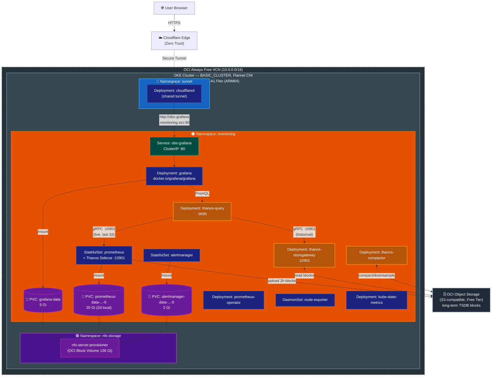

# Self-hosted Grafana + Prometheus + Thanos on OKE Always Free

Deploy a fully self-hosted monitoring stack — **kube-prometheus-stack** with **Thanos** — on an OCI Always Free ARM64 OKE cluster. Grafana is exposed via the existing Cloudflare Zero Trust Tunnel. All metric and dashboard data persists on the NFS `StorageClass` and in OCI Object Storage (long-term, via Thanos), surviving `helm uninstall`.

> **Helm Charts**: `prometheus-community/kube-prometheus-stack`, `bitnami/thanos`
> **Coexists with**: `modules/monitoring` (Grafana Alloy → Grafana Cloud, optional)

---

## Table of Contents

- [Architecture Overview](#architecture-overview)
- [Prerequisites](#prerequisites)
- [Deployment Steps](#deployment-steps)
  - [Step 1: Pre-create Namespace and Grafana PVC](#step-1-pre-create-namespace-and-grafana-pvc)
  - [Step 2: Add Helm Repositories](#step-2-add-helm-repositories)
  - [Step 3: Create Object Storage Secret](#step-3-create-object-storage-secret)
  - [Step 4: Install kube-prometheus-stack](#step-4-install-kube-prometheus-stack)
  - [Step 5: Deploy Thanos](#step-5-deploy-thanos)
  - [Step 6: Deploy Loki](#step-6-deploy-loki)
  - [Step 7: Configure Cloudflare Tunnel Public Hostname](#step-7-configure-cloudflare-tunnel-public-hostname)
  - [Step 8: Verify Deployment](#step-8-verify-deployment)
  - [Step 9: Set PV Reclaim Policy to Retain](#step-9-set-pv-reclaim-policy-to-retain)
- [Upgrades and Reinstallation](#upgrades-and-reinstallation)
- [Online PVC Expansion](#online-pvc-expansion)
- [Resource and Storage Allocation](#resource-and-storage-allocation)
- [Troubleshooting](#troubleshooting)
- [Teardown](#teardown)

---

## Architecture Overview



### Traffic Path

```
User ──HTTPS──▶ Cloudflare Public Hostname (grafana.your-domain.com)
     ──Tunnel──▶ cloudflared Pod (outbound-only, namespace: tunnel)
     ──HTTP────▶ obs-grafana Service (ClusterIP, namespace: monitoring)
     ──────────▶ Grafana Pod (:3000 → exposed on :80)
                  └──PromQL──▶ Thanos Query :9090
                                ├──gRPC──▶ Prometheus Thanos Sidecar :10901 (live, 2d)
                                └──gRPC──▶ Thanos Store Gateway :10901 (historical)
                                                └── OCI Object Storage
```

### Thanos Data Flow

```
Prometheus ──(every 2h)──▶ Thanos Sidecar ──upload block──▶ OCI Object Storage
                                                                     │
                                           Thanos Compactor ◀──read/write──┤
                                           Thanos Store Gateway ◀──read────┘
```

Local TSDB retention: **2 days** (NFS PVC).
Long-term retention: **90 days raw / 1 year 5m / 3 years 1h** (object storage).

### PVC Persistence Model

| PVC | Created by | Survives `helm uninstall`? |
|-----|-----------|--------------------------|
| `grafana-data` | `kubectl apply -f pvc-grafana.yaml` (pre-created) | ✅ Not managed by Helm |
| `prometheus-data-prometheus-obs-prometheus-0` | StatefulSet `volumeClaimTemplate` on first install | ✅ Kubernetes never auto-deletes StatefulSet PVCs |
| `alertmanager-data-alertmanager-obs-alertmanager-0` | StatefulSet `volumeClaimTemplate` on first install | ✅ Kubernetes never auto-deletes StatefulSet PVCs |

> Grafana uses a `Deployment` with `existingClaim`, so its PVC must exist before `helm install`. Prometheus and Alertmanager use `StatefulSet`s — the operator creates their PVCs on first install and Kubernetes guarantees they are never garbage-collected when the StatefulSet is removed. On reinstall, the new StatefulSets reuse the existing PVCs by name automatically.
>
> PVC names for Prometheus and Alertmanager follow the convention: `<metadata.name in values.yaml>-<statefulset-name>-<ordinal>`. They are tied to the Helm release name **`obs`**.

---

## Prerequisites

| Requirement | Details |
|-------------|---------|
| **kubectl** | Configured to connect to the OKE cluster |
| **Helm** | >= 3.0.0 |
| **NFS StorageClass** | `enable_nfs_storage = true` applied via Terraform (`storageClassName: nfs` must exist) |
| **Cloudflare Tunnel** | `enable_cloudflare_tunnel = true` applied via Terraform (the shared `cloudflared` Deployment must be running) |
| **OCI Object Storage bucket** | Any region; Free Tier includes 10 GB — sufficient for months of compressed TSDB blocks |
| **OCI Customer Secret Key** | For S3-compatible API access. Create in OCI Console → Identity → Users → `<your user>` → **Customer Secret Keys** → **Generate Secret Key** (save the secret value — it is shown only once) |

> **Namespace conflict note**: If `enable_alloy_to_grafana_cloud = true` is already applied via Terraform, the `monitoring` namespace is Terraform-managed. In that case, **skip** `kubectl apply -f namespace.yaml`.

Verify cluster connectivity and NFS availability:

```bash
kubectl get nodes
# Expected: ARM64 worker node in Ready state

kubectl get storageclass nfs
# Expected: nfs storageclass listed
```

---

## Deployment Steps

### Step 1: Pre-create Namespace and Grafana PVC

Only the Grafana PVC needs to be pre-created — Grafana uses a `Deployment` with `existingClaim`, so the PVC must exist before `helm install`. Prometheus and Alertmanager PVCs are created automatically by their StatefulSets on first install.

```bash
# Skip namespace.yaml if enable_alloy_to_grafana_cloud = true is already applied
kubectl apply -f k8s/monitoring/namespace.yaml

kubectl apply -f k8s/monitoring/pvc-grafana.yaml

# Verify — should show Pending (will bind when Grafana pod first mounts it)
kubectl get pvc -n monitoring
```

### Step 2: Add Helm Repositories

```bash
helm repo add prometheus-community https://prometheus-community.github.io/helm-charts
helm repo add bitnami https://charts.bitnami.com/bitnami
helm repo update
```

### Step 3: Create Object Storage Secret

Fill in your OCI bucket credentials and apply the secret **before** installing the Helm charts.

```bash
# Copy the example and fill in real values
cp k8s/monitoring/secret-thanos-objstore.example.yaml secret-thanos-objstore.yaml
# Edit secret-thanos-objstore.yaml:
#   bucket:     your OCI bucket name
#   endpoint:   <oci-namespace>.compat.objectstorage.<region>.oraclecloud.com
#   access_key: Customer Secret Key ID
#   secret_key: Customer Secret Key value

kubectl apply -f secret-thanos-objstore.yaml
# DO NOT commit secret-thanos-objstore.yaml — it is in .gitignore
```

### Step 4: Install kube-prometheus-stack

Replace `<your-password>` with a strong Grafana admin password.

```bash
helm upgrade --install obs prometheus-community/kube-prometheus-stack \
  --namespace monitoring \
  --create-namespace \
  -f k8s/monitoring/values.yaml \
  --set grafana.adminPassword="G$nq9&*!r35&"
#  --set grafana.adminPassword="<your-password>"
> Release "obs" has been upgraded. Happy Helming!
> NAME: obs
> LAST DEPLOYED: Fri Apr 10 02:26:36 2026
> NAMESPACE: monitoring
> STATUS: deployed
> REVISION: 2
> DESCRIPTION: Upgrade complete
> TEST SUITE: None
> NOTES:
> kube-prometheus-stack has been installed. Check its status by running:
>   kubectl --namespace monitoring get pods -l "release=obs"
> 
> Get Grafana 'admin' user password by running:
> 
>   kubectl --namespace monitoring get secrets obs-grafana -o jsonpath="{.data.admin-password}" | base64 -d ; echo
> 
> Access Grafana local instance:
> 
>   export POD_NAME=$(kubectl --namespace monitoring get pod -l "app.kubernetes.io/name=grafana,app.kubernetes.io/instance=obs" -oname)
>   kubectl --namespace monitoring port-forward $POD_NAME 3000
> 
> Get your grafana admin user password by running:
> 
>   kubectl get secret --namespace monitoring -l app.kubernetes.io/component=admin-secret -o jsonpath="{.items[0].data.admin-password}" | base64 --decode ; echo
> 
> 
> Visit https://github.com/prometheus-operator/kube-prometheus for instructions on how to create & configure Alertmanager and Prometheus instances using the Operator.
```

> **Tip**: Store the admin password in your password manager. Retrieve later with: `helm get values obs -n monitoring`

Monitor rollout:

```bash
kubectl rollout status deployment/obs-grafana -n monitoring
kubectl rollout status statefulset/prometheus-obs-prometheus -n monitoring
kubectl rollout status statefulset/alertmanager-obs-alertmanager -n monitoring
```

Verify the Thanos sidecar is running alongside Prometheus:

```bash
kubectl get pods -n monitoring -l app.kubernetes.io/name=prometheus
# Expected: 2/2 Ready (prometheus container + thanos-sidecar container)
```

### Step 5: Deploy Thanos

```bash
helm upgrade --install thanos bitnami/thanos \
  --namespace monitoring \
  -f k8s/monitoring/thanos-values.yaml
```

Monitor rollout:

```bash
kubectl rollout status deployment/thanos-query -n monitoring
kubectl rollout status deployment/thanos-storegateway -n monitoring
```

Verify Thanos Query can reach the sidecar and store gateway:

```bash
kubectl port-forward svc/thanos-query 9090:9090 -n monitoring
# Open http://localhost:9090/stores — both endpoints should show as Healthy
```

### Step 6: Deploy Loki

Loki provides self-hosted log storage. Alloy is managed by Terraform, so enabling dual-write requires patching the Alloy ConfigMap via the provided script.

**6a. Create Loki R2 credentials secret:**

```bash
cp k8s/monitoring/secret-loki-r2.example.yaml secret-loki-r2.yaml
# Edit secret-loki-r2.yaml with your R2 access key ID and secret access key
kubectl apply -f secret-loki-r2.yaml
```

> Obtain credentials: Cloudflare Dashboard → R2 → **Manage R2 API Tokens** → Create API Token (Object Read & Write on the Loki bucket).

**6b. Update `loki-values.yaml` with your bucket and endpoint:**

```yaml
loki:
  storage:
    bucketNames:
      chunks: <your-loki-r2-bucket>
      ruler: <your-loki-r2-bucket>
      admin: <your-loki-r2-bucket>
    s3:
      endpoint: <account-id>.r2.cloudflarestorage.com
```

**6c. Install Loki:**

```bash
helm upgrade --install loki grafana/loki \
  --namespace monitoring \
  -f k8s/monitoring/loki-values.yaml
```

**6d. Enable Alloy dual-write:**

Run the patch script to add `loki.write "local"` to the Alloy ConfigMap and restart the DaemonSet:

```bash
chmod +x k8s/monitoring/alloy-enable-loki.sh
./k8s/monitoring/alloy-enable-loki.sh
```

The script is idempotent — safe to re-run. It patches the Alloy ConfigMap in-place (preserving the Terraform-managed base config) and adds `loki.write.local.receiver` to the `forward_to` arrays for pod logs and Kubernetes events.

**6e. Verify Loki is receiving logs:**

```bash
kubectl get pods -n monitoring -l app.kubernetes.io/name=loki
# Should show 1/1 Running

kubectl logs -n monitoring -l app.kubernetes.io/name=loki --tail=20
# Look for: "Starting Loki" and no S3 credential errors
```

In Grafana, navigate to **Explore → Loki datasource** and run:

```logql
{namespace="monitoring"} | line_format "{{.message}}"
```

### Step 7: Configure Cloudflare Tunnel Public Hostname

1. Navigate to [Cloudflare Zero Trust Dashboard](https://one.dash.cloudflare.com)
2. Go to **Networks → Tunnels → your existing tunnel → Configure → Public Hostnames**
3. Add a new public hostname:

   | Field | Value |
   |-------|-------|
   | Subdomain | `grafana` |
   | Domain | `your-domain.com` |
   | Type | `HTTP` |
   | URL | `obs-grafana.monitoring.svc.cluster.local:80` |

4. Save the configuration

> The `cloudflared` Pod is in the `tunnel` namespace — the full cluster-local FQDN is required for cross-namespace service resolution.

### Step 8: Verify Deployment

```bash
# All pods should be Running
kubectl get pods -n monitoring

# Confirm all PVCs are bound
kubectl get pvc -n monitoring

# Stream Grafana logs
kubectl logs -n monitoring deployment/obs-grafana -c grafana
```

Open Grafana:

```
https://grafana.your-domain.com
```

Log in with username `admin` and the password set in Step 4.

Verify metrics: **Explore → Select Prometheus datasource → Run `up`** — all scraped targets should return `1`.

> **Grafana datasources**: Two datasources are pre-configured by `values.yaml`:
> - **Prometheus** (default) — added automatically by kube-prometheus-stack, points directly at `obs-prometheus:9090` for the live 2-day window
> - **Thanos** — added via `additionalDataSources`, points at `thanos-query:9090` for the full retention period (2 days live + object storage history)

### Step 9: Set PV Reclaim Policy to Retain

The `nfs` StorageClass uses `reclaimPolicy: Delete` by default — a deleted PVC permanently destroys the backing PV. Patch to `Retain` immediately after all PVCs are bound.

```bash
# Wait until all PVCs are Bound
kubectl get pvc -n monitoring -w

# Determine which PV backs each PVC
PV_GRAFANA=$(kubectl get pvc grafana-data -n monitoring -o jsonpath='{.spec.volumeName}')
PV_PROMETHEUS=$(kubectl get pvc prometheus-data-prometheus-obs-prometheus-0 \
  -n monitoring -o jsonpath='{.spec.volumeName}')
PV_ALERTMANAGER=$(kubectl get pvc alertmanager-data-alertmanager-obs-alertmanager-0 \
  -n monitoring -o jsonpath='{.spec.volumeName}')

# Patch all three PVs to Retain
kubectl patch pv "$PV_GRAFANA"      -p '{"spec":{"persistentVolumeReclaimPolicy":"Retain"}}'
kubectl patch pv "$PV_PROMETHEUS"   -p '{"spec":{"persistentVolumeReclaimPolicy":"Retain"}}'
kubectl patch pv "$PV_ALERTMANAGER" -p '{"spec":{"persistentVolumeReclaimPolicy":"Retain"}}'

echo "✓ PVs patched: $PV_GRAFANA  $PV_PROMETHEUS  $PV_ALERTMANAGER"

# Verify
kubectl get pv "$PV_GRAFANA" "$PV_PROMETHEUS" "$PV_ALERTMANAGER" \
  -o custom-columns='NAME:.metadata.name,RECLAIM:.spec.persistentVolumeReclaimPolicy,STATUS:.status.phase'
```

> After patching to `Retain`: if a PVC is deleted, the PV transitions to `Released` state and NFS data is preserved. See [Recovering a Released PV](#recovering-a-released-pv) below.

### Recovering a Released PV

**Grafana** (`grafana-data` — file-based PVC):

```bash
# 1. Identify the Released PV
kubectl get pv | grep Released

# 2. Remove the claimRef so the PV can be rebound
kubectl patch pv <pv-name> -p '{"spec":{"claimRef":null}}'

# 3. Edit pvc-grafana.yaml — uncomment and set the volumeName field:
#      spec:
#        volumeName: <pv-name>
kubectl apply -f k8s/monitoring/pvc-grafana.yaml
```

**Prometheus / Alertmanager** (StatefulSet PVCs — no pre-existing manifest):

```bash
# 1. Remove the claimRef from the released PV
kubectl patch pv <pv-name> -p '{"spec":{"claimRef":null}}'

# 2. Re-create the PVC with volumeName to force binding to the specific PV
kubectl apply -f - <<EOF
apiVersion: v1
kind: PersistentVolumeClaim
metadata:
  name: prometheus-data-prometheus-obs-prometheus-0   # or alertmanager-data-...
  namespace: monitoring
spec:
  accessModes:
    - ReadWriteOnce
  storageClassName: nfs
  volumeName: <pv-name>
  resources:
    requests:
      storage: 20Gi   # 2Gi for alertmanager
EOF
```

The PVC will transition to `Bound`; when the StatefulSet Pod restarts it remounts the original data.

---

## Upgrades and Reinstallation

### Upgrade the chart version

```bash
helm repo update
helm upgrade obs prometheus-community/kube-prometheus-stack \
  --namespace monitoring \
  -f k8s/monitoring/values.yaml \
  --set grafana.adminPassword="<your-password>"
```

### Reinstall (after `helm uninstall`)

All PVCs persist after `helm uninstall` — Grafana's because it is pre-created and Helm-independent; Prometheus's and Alertmanager's because Kubernetes never garbage-collects StatefulSet PVCs. Reinstall with the same command and all data is automatically remounted.

```bash
# Uninstall (all PVCs are preserved)
helm uninstall obs -n monitoring

# Reinstall — existing PVCs are rebound by name automatically
helm upgrade --install obs prometheus-community/kube-prometheus-stack \
  --namespace monitoring \
  -f k8s/monitoring/values.yaml \
  --set grafana.adminPassword="<your-password>"
```

---

## Online PVC Expansion

The `nfs` StorageClass has `allowVolumeExpansion: true` (default in `nfs-server-provisioner` v1.8.0), enabling online volume expansion without downtime.

### Grafana (Deployment — immediate resize)

```bash
kubectl patch pvc grafana-data -n monitoring \
  -p '{"spec":{"resources":{"requests":{"storage":"10Gi"}}}}'

# The filesystem is resized automatically; no pod restart required
kubectl describe pvc grafana-data -n monitoring | grep -A5 Conditions
```

### Prometheus / Alertmanager (StatefulSet — one-step resize)

Since these PVCs are pre-created independently and use `storageSpec.volumeClaimTemplate`, the StatefulSet manages the volume claim but the PVC already exists — resize is a single `kubectl patch`.

```bash
# Resize Prometheus data volume
kubectl patch pvc prometheus-data-prometheus-obs-prometheus-0 \
  -n monitoring \
  -p '{"spec":{"resources":{"requests":{"storage":"40Gi"}}}}'

# Resize Alertmanager data volume
kubectl patch pvc alertmanager-data-alertmanager-obs-alertmanager-0 \
  -n monitoring \
  -p '{"spec":{"resources":{"requests":{"storage":"4Gi"}}}}'

# NFS resizes automatically; no pod restart required
```

---

## Resource and Storage Allocation

### Kubernetes Resource Budget

| Component | CPU request | CPU limit | Memory request | Memory limit |
|-----------|------------|-----------|----------------|-------------|
| Prometheus | 200m | 500m | 512Mi | 1Gi |
| Thanos sidecar | 50m | 100m | 64Mi | 128Mi |
| Grafana | 100m | 300m | 128Mi | 256Mi |
| Grafana sidecar | 50m | 100m | 64Mi | 128Mi |
| Alertmanager | 10m | 100m | 32Mi | 64Mi |
| prometheus-operator | 100m | 200m | 128Mi | 256Mi |
| admission webhook | 25m | 50m | 32Mi | 64Mi |
| node-exporter | 100m | 200m | 30Mi | 64Mi |
| kube-state-metrics | 10m | 100m | 32Mi | 64Mi |
| Thanos Query | 100m | 300m | 128Mi | 256Mi |
| Thanos Store Gateway | 100m | 200m | 128Mi | 256Mi |
| Thanos Compactor | 100m | 400m | 128Mi | 512Mi |
| Loki | 100m | 500m | 256Mi | 512Mi |
| **Total** | **1045m** | **3050m** | **1.656Gi** | **3.5Gi** |

Always Free node capacity: **4 OCPU (4000m)**, **24 GB RAM** — the monitoring stack consumes ≈26% CPU and ≈6.9% RAM at peak requests.

### NFS Storage Allocation

| PVC | Size | Consumer |
|-----|------|---------|
| `prometheus-data-prometheus-obs-prometheus-0` | 20 Gi | Prometheus metrics (2d local retention; historical in OCI Object Storage) |
| `alertmanager-data-alertmanager-obs-alertmanager-0` | 2 Gi | Alertmanager state |
| `grafana-data` | 5 Gi | Dashboards, datasource configs |
| `storage-loki-0` | 10 Gi | Loki WAL and local ingester buffer |
| `n8n-data` (existing) | 5 Gi | n8n workflows and SQLite DB |
| **Total** | **42 Gi** | out of 136 Gi NFS backing volume |

> Thanos Store Gateway and Compactor use `emptyDir` (no NFS PVC) — index headers are rebuilt from OCI Object Storage on restart, and the compactor uses local disk only as a transient working directory.

---

## Troubleshooting

### Pods stuck in `Pending` — PVC not binding

```bash
kubectl describe pvc -n monitoring
kubectl get pods -n nfs-storage  # Verify nfs-server-provisioner is running
```

Ensure `enable_nfs_storage = true` is applied in Terraform before deploying this stack.

### Grafana: `502 Bad Gateway` from Cloudflare

```bash
# Confirm Grafana pod is Running
kubectl get pods -n monitoring -l app.kubernetes.io/name=grafana

# Check Grafana logs
kubectl logs -n monitoring deployment/obs-grafana -c grafana

# Verify Service endpoint
kubectl get endpoints obs-grafana -n monitoring

# Test connectivity from within the cluster
kubectl run curl-test --rm -it --image=docker.io/curlimages/curl:latest \
  -n monitoring -- curl -s http://obs-grafana.monitoring.svc.cluster.local:80/api/health
```

### `ImagePullBackOff` — CRI-O short-name rejection

OKE uses CRI-O in short-name enforcement mode. All image references must use a fully qualified registry path. `kube-prometheus-stack` already uses fully qualified names (`quay.io/prometheus/*`, `docker.io/grafana/grafana`). If you add custom sidecars or init containers, ensure the image path includes the registry host.

### Prometheus targets show `connection refused` for controller-manager / scheduler / etcd

OKE's control plane components are managed by Oracle and are not accessible from within the cluster. This is expected — `kubeControllerManager`, `kubeScheduler`, `kubeEtcd`, and `kubeProxy` are disabled in `values.yaml`.

### Grafana dashboard shows no data

1. Verify the Prometheus datasource URL is `http://obs-prometheus.monitoring.svc.cluster.local:9090`
2. Navigate to **Explore**, select the `Prometheus` datasource, and run the query `up` to confirm metrics are ingested
3. Check Prometheus targets: `kubectl port-forward svc/obs-prometheus -n monitoring 9090:9090` → open `http://localhost:9090/targets`

---

## Teardown

### Disable Grafana access (remove Cloudflare Public Hostname only)

Remove the `grafana.your-domain.com` public hostname from Cloudflare Dashboard without removing any Kubernetes resources.

### Uninstall the stack (preserve all data)

```bash
helm uninstall obs -n monitoring
helm uninstall thanos -n monitoring
helm uninstall loki -n monitoring
```

All PVCs are retained. Reinstall at any time to recover all data.

### Full removal (delete all resources and data)

```bash
# 1. Uninstall Helm releases
helm uninstall obs -n monitoring
helm uninstall thanos -n monitoring
helm uninstall loki -n monitoring

# 2. Delete secrets
kubectl delete secret thanos-objstore-secret loki-r2-secret -n monitoring

# 3. Delete the Grafana PVC (data will be permanently lost)
kubectl delete pvc grafana-data -n monitoring

# 4. Delete Prometheus, Alertmanager, and Loki PVCs (data will be permanently lost)
kubectl delete pvc prometheus-data-prometheus-obs-prometheus-0 -n monitoring
kubectl delete pvc alertmanager-data-alertmanager-obs-alertmanager-0 -n monitoring
kubectl delete pvc storage-loki-0 -n monitoring

# 5. Delete the namespace
kubectl delete namespace monitoring
```

> ⚠️ Deleting the namespace cascades to all remaining PVCs and their backing NFS volumes. This action is irreversible.
